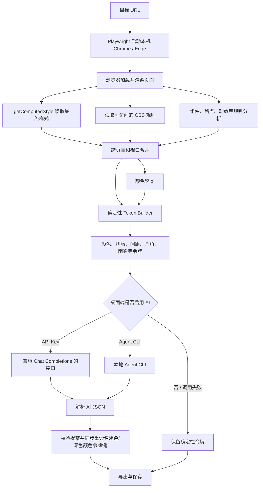
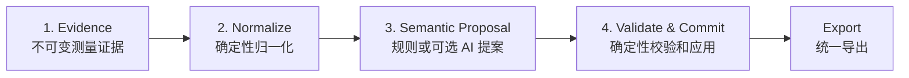

# Imprint 网站分析与 AI 语义增强方案

> 本文说明 Imprint 当前如何从目标网站提取设计系统、为什么核心提取不需要 AI、提取完成后 AI 实际做了什么，以及后续怎样在不破坏确定性的前提下改进这条链路。
>
> 文档中的“当前实现”是对现有代码的描述；“建议方案”是后续重构方向，不代表已经实现。

## 1. 先说结论

Imprint 的工作可以分成两层：

1. **确定性分析层**：启动真实浏览器，读取浏览器最终计算出的样式，进行统计、聚类和令牌构建。
2. **可选 AI 语义层**：把已经生成的少量设计令牌发给 AI，让 AI 尝试把 `primary` 之类的通用名称改成更贴近用途的语义名称。

核心原则是：

> 浏览器负责回答“页面实际上是什么”，AI 只适合辅助回答“这些设计值可能代表什么”。

因此，即使没有 API Key、没有安装 Agent CLI、AI 调用超时或返回了无效内容，Imprint 仍然可以完成网站分析并导出 CSS、Tailwind、JSON 和设计文档。AI 不是提取引擎，也不应该成为提取成功的前置条件。

当前 AI 的作用比界面文案可能让人联想到的范围更小：

- AI 不访问目标网站。
- AI 不读取 DOM、HTML 或完整 CSS。
- AI 不看截图。
- AI 不提取颜色、字体、间距或组件。
- AI 不修改令牌值。
- AI 当前只会提出**颜色令牌重命名**。
- AI 当前只返回结构化颜色重命名提案，不再生成或丢弃设计摘要、设计意图和 AI 特征标签。

## 2. 当前整体数据流



三个入口共享核心分析能力，但当前 AI 行为并不完全相同：

| 入口            | 核心提取 | 可选 AI 增强 | 主要代码                                   |
| --------------- | -------- | ------------ | ------------------------------------------ |
| Electron 桌面端 | 有       | 有           | [`src/main/ipc.ts`](./src/main/ipc.ts)     |
| 独立 CLI        | 有       | 当前没有     | [`src/cli/index.ts`](./src/cli/index.ts)   |
| MCP Server      | 有       | 当前没有     | [`src/mcp/server.ts`](./src/mcp/server.ts) |

CLI 和 MCP 当前输出的是纯确定性分析结果。桌面端会在确定性分析完成后，根据设置选择 API Key 或本地 Agent CLI 做一次可选后处理。

## 3. 第一阶段：怎样从网站提取设计信息

核心入口是 [`src/core/analyzer/index.ts`](./src/core/analyzer/index.ts) 中的 `analyze()`。这部分不依赖 Electron，也不依赖任何 AI 服务，因此 CLI 和 MCP 可以直接复用。

桌面端的 [`src/main/analyzer/index.ts`](./src/main/analyzer/index.ts) 只是适配 Electron 的用户数据目录等运行环境，并没有改变核心提取原理。

### 3.1 查找并启动真实浏览器

Imprint 使用 `playwright-core` 控制浏览器。`playwright-core` 本身不附带浏览器，所以 [`browser-finder.ts`](./src/core/analyzer/browser-finder.ts) 会按操作系统查找已经安装的 Chrome、Edge 或 Chromium。

使用真实浏览器非常重要，因为页面最终样式可能来自：

- 外部样式表；
- CSS 变量；
- 继承；
- 选择器优先级；
- 媒体查询；
- JavaScript 动态添加的 class 或内联样式；
- 浏览器默认样式；
- 当前视口尺寸；
- 当前颜色模式。

Imprint 不需要自己重新实现一套 CSS 解析和层叠算法，而是让浏览器完成它最擅长的工作，然后读取浏览器的最终计算结果。

默认视口是桌面端：

| 名称    | 宽度 | 高度 |
| ------- | ---: | ---: |
| desktop | 1440 |  900 |
| tablet  |  768 | 1024 |
| mobile  |  375 |  812 |

调用方可以指定多个视口。页面数量会被限制在 1 到 5 页之间，默认最多分析 3 页。

### 3.2 加载页面并等待可测量状态

页面导航首先等待 `domcontentloaded`，随后尽力等待网络进入空闲状态，最长约 5 秒。字体分析还会尽力等待 `document.fonts.ready`，同样设置超时，避免某个资源一直不结束导致整个分析挂起。

这是一种工程折中：

- 不能只等待 HTML，因为 CSS、字体和前端脚本可能尚未应用；
- 也不能无限等待，因为广告、埋点、长连接和轮询可能永远不会进入绝对空闲。

### 3.3 登录墙和受保护页面

[`auth-wall.ts`](./src/core/analyzer/auth-wall.ts) 会通过以下信号判断页面是否被登录墙阻挡：

- URL 路径是否明显指向登录页；
- HTTP 状态是否为 401 或 403；
- 是否存在可见的密码输入框；
- 是否存在阻挡页面内容的登录对话框；
- 页面是否几乎只有登录内容。

桌面端可以使用隔离的持久化浏览器配置，让用户在隔离环境中完成登录。它不会直接复用用户日常 Chrome 配置文件。

登录状态只用于让浏览器成功渲染页面。登录信息、Cookie 和浏览器存储不会进入 AI 提示词。

### 3.4 用 `getComputedStyle()` 读取最终样式

核心提取逻辑位于 [`style-extractor.ts`](./src/core/analyzer/style-extractor.ts)。

代码进入页面上下文，遍历 `body *`，对可见元素调用 `getComputedStyle()`。`getComputedStyle()` 返回的是浏览器完成层叠、继承、变量替换和单位计算之后的最终值。

当前采集的主要数据包括：

| 分类     | 示例                                      |
| -------- | ----------------------------------------- |
| 文本色   | `rgb(17, 24, 39)`                         |
| 背景色   | `rgb(255, 255, 255)`                      |
| 边框色   | `rgb(229, 231, 235)`                      |
| 字体族   | `Inter, sans-serif`                       |
| 字号     | `16px`                                    |
| 字重     | `400`、`600`                              |
| 行高     | `24px`                                    |
| 字间距   | `0.01em`                                  |
| 间距     | margin、padding、gap、row-gap、column-gap |
| 圆角     | `8px`                                     |
| 阴影     | `0 1px 3px rgba(...)`                     |
| 边框     | 顶边框的宽度、样式和颜色                  |
| 层级     | `z-index`                                 |
| 过渡     | `transition-duration`                     |
| CSS 变量 | `:root` 中可读取的自定义属性              |

同时，提取器会记录 `usageCount`。例如：

```text
textColor:rgb(17, 24, 39) -> 128
backgroundColor:rgb(255, 255, 255) -> 42
spacing:16px -> 317
```

这些次数本来可以帮助系统区分“主流设计值”和偶然出现的值。

当前会跳过 `display: none` 和 `visibility: hidden` 的元素。透明度为 0、尺寸为 0 或位于屏幕外的元素仍有可能被统计。

### 3.5 读取 CSS 自定义属性

提取器会遍历当前页面可访问的样式表，收集 `:root` 规则中的 CSS 自定义属性，例如：

```css
:root {
  --brand-500: #2563eb;
  --space-md: 16px;
}
```

浏览器安全模型不允许页面脚本读取某些跨域样式表的 `cssRules`，遇到这种情况代码会跳过对应样式表。即使原始规则不可读取，已经应用到 DOM 元素上的 computed style 通常仍然可以读取，因此主要的视觉值提取不会完全失效。

目前原始 CSS 变量主要作为“网站是否由设计令牌驱动”的证据，还没有直接保留其原始命名并映射到最终导出令牌。

### 3.6 分析交互状态

`extractInteractionStyles()` 会检查可访问的 CSS 规则，寻找包含以下伪类的选择器：

- `:hover`
- `:focus`
- `:active`

它会保存这些规则中的声明，用于描述交互状态。当前只在第一个视口执行一次。

这是对样式表规则的静态读取，不会真的把鼠标移动到每个元素上，也不会逐个触发键盘焦点。因此它能低成本覆盖常见写法，但无法覆盖所有由 JavaScript 状态机动态产生的交互样式。

### 3.7 分析深色模式

`extractDarkMode()` 使用两种方式寻找深色主题：

1. 检查样式表是否包含 `prefers-color-scheme: dark`，然后让浏览器模拟深色偏好并重新提取；
2. 如果没有媒体查询，则尝试 `.dark`、`[data-theme="dark"]`、`[data-color-mode="dark"]`、`[data-mode="dark"]` 等常见主题标记。

切换后会短暂等待页面更新，再次运行样式提取，最后恢复原状态。深色分析也只在第一个视口执行。

这种方法可以覆盖常见 CSS 主题方案，但无法保证识别完全由应用内部状态、远程配置或复杂 JavaScript 控制的主题。

### 3.8 识别常见组件

[`component-detect.ts`](./src/core/analyzer/component-detect.ts) 通过分层证据识别常见组件：

- 按钮；
- 卡片；
- 导航；
- 输入框；
- 表格；
- 对话框；
- 列表。

原生 HTML 元素的置信度最高，ARIA role 次之，class 名称只作为较弱证据。候选还必须通过可见性检查：隐藏属性、`aria-hidden`、`inert`、`display: none`、不可见、全透明或零尺寸元素不会进入结果。

卡片没有标准 HTML/ARIA 语义，因此仍使用可解释的视觉评分：圆角、边框/阴影、四向内边距、独立表面、内容、子结构、重复兄弟结构和媒体/操作元素会增加置信度，大型布局容器会被降权。只有达到阈值的可见候选才会被保留。

同类候选聚合后会输出：

- 可见候选数量；
- 平均置信度；
- 合并后的证据列表；
- 出现次数最多的代表样式，而不是简单取第一个样本。

识别结果仍然表示“页面中很可能存在这类结构”，不是完整组件源码还原。特别是 Card 等非标准语义组件，置信度用于表达启发式判断的边界，不能当作绝对事实。

### 3.9 提取响应式断点和动效

[`responsive-motion.ts`](./src/core/analyzer/responsive-motion.ts) 会读取可访问样式表中的媒体规则，解析以像素表示的 `min-width` 和 `max-width`，并按宽度给出 mobile、tablet、desktop、wide 等标签。

动效分析会遍历元素的 computed style，统计 transition 和 animation 相关值，按频率保留主要模式。

核心分析结果中包含 motion 数据，但桌面端当前没有把这部分完整暴露给导出和界面。

### 3.10 多页面采样

主页面分析完成后，Imprint 会收集同源链接，优先扫描导航、页头、侧栏等区域，同时也会查看普通链接。

链接会经过过滤：

- 必须与目标 URL 同源；
- 忽略 hash；
- 忽略退出、登录 API 等明显无关路径；
- 忽略 PDF、ZIP 等非 HTML 资源；
- 忽略错误页面和登录墙。

子页面只按主视口提取 computed style 和截图，不会重复执行全部组件、交互状态和深色模式分析。最终分析页数受页面上限控制。

这不是完整网站爬虫，而是用于丰富设计系统样本的有限采样器。

### 3.11 合并多页面和多视口数据

[`style-merge.ts`](./src/core/analyzer/style-merge.ts) 会：

- 合并各页面和视口的样式数组；
- 累加 `usageCount`；
- 合并 CSS 变量；
- 对多个值数组去重，以控制跨页面结果体积。

去重后的数组只负责保存候选值；真实使用次数由 `usageCount` 负责。颜色聚类和令牌构建器现在统一优先从分类计数表读取频率：

- 颜色会合并文字、背景和边框上下文中的次数；
- 字体、字号、字重、行高、字间距、间距、圆角、阴影和边框按各自分类次数排序；
- `z-index` 和 transition 也会记录分类次数；
- 对旧数据或手工构造数据，如果没有 `usageCount`，仍会回退到数组频率。

这解决了“数组提前去重导致所有候选看起来只出现一次”的问题。剩余限制是：当前次数仍以 computed style 出现的元素/属性次数为主，还没有区分视觉面积、继承放大、页面权重和组件角色。

此外，多页面 CSS 变量当前采用后写覆盖前写。如果不同页面给同名变量赋不同值，最终只保留一个值，缺少来源信息。

### 3.12 颜色聚类

[`color-cluster.ts`](./src/core/analyzer/color-cluster.ts) 会：

1. 解析 RGB、RGBA 和十六进制颜色；
2. 统计输入颜色；
3. 使用 RGB 空间中的欧氏距离把相近颜色归到一组；
4. 使用距离阈值 30；
5. 按聚类总次数排序，最多保留 20 个聚类；
6. 选择组内出现最多的颜色作为代表色；
7. 按亮度把聚类粗分为背景色、文本色和强调色。

亮度大于 0.85 的颜色倾向于背景色，小于 0.15 的颜色倾向于文本色，中间区域倾向于强调色。

当前实现的限制：

- RGB 距离不完全符合人眼对色差的感知；
- 聚类以组内第一个颜色为距离参照，存在一定顺序依赖；
- alpha 会被解析，但代表值最终转成十六进制时没有保留透明度；
- 频率现在来自真实分类计数，但尚未根据视觉面积、页面类型或组件重要性加权。

### 3.13 构建设计令牌

[`token-builder.ts`](./src/core/analyzer/token-builder.ts) 把原始测量结果转换成稳定、可导出的设计令牌。

#### 颜色命名规则

当前初始颜色名称由固定规则生成：

| 来源             | 默认名称                   |
| ---------------- | -------------------------- |
| 第 1 个背景色    | `background`               |
| 第 2 个背景色    | `surface`                  |
| 第 1 个文本色    | `foreground`               |
| 第 2 个文本色    | `muted-foreground`         |
| 第 1 个强调色    | `primary`                  |
| 第 2 个强调色    | `secondary`                |
| 第 3 个强调色    | `accent`                   |
| 使用最多的边框色 | `border`                   |
| 其他颜色         | `palette-1`、`palette-2`…… |

这套名称不一定能表达产品真实业务语义，但它稳定、可预测，而且完全不依赖 AI。

#### 排版令牌

- 字号转换为 `rem`，基准为 16px，最多保留主要的 8 个；
- 字重最多保留 5 个；
- 行高如果是像素值，则除以 16 转成无单位数值，最多保留 5 个；
- 字体栈和主要字体族最多分别保留 5 个；
- 字间距按数值排序，最多保留 6 个。

#### 其他令牌

- 间距只保留大于 0 且不超过 200px 的值，最多 12 个；
- 圆角排除 0，最多 5 个；
- 阴影最多 4 个；
- 边框最多 4 个；
- `z-index` 最多 8 个；
- 过渡时长最多 6 个。

这些选择都是明确的代码规则。给定相同的页面渲染结果，就能得到相同的令牌结果。

### 3.14 生成特征标签

[`feature-tags.ts`](./src/core/analyzer/feature-tags.ts) 使用确定性规则生成最多 5 个特征标签，例如：

- spacing 是否接近规则网格；
- 是否主要使用等宽字体或衬线字体；
- 色板是极简、丰富还是近似单色；
- 圆角整体偏硬朗还是偏柔和；
- 阴影是扁平还是层次丰富；
- 字重和字号层级是否丰富；
- 是否大量使用 CSS 变量。

这些特征标签不是 AI 生成的。

### 3.15 生成导出内容

[`src/core/export/index.ts`](./src/core/export/index.ts) 根据最终令牌确定性生成：

- CSS Variables；
- Tailwind v4 `@theme`；
- DTCG 风格的 Tokens JSON；
- SCSS Variables；
- `DESIGN.md`；
- 用于生成 PDF 的 HTML。

设计文档中的设计原则、规则、Do/Don't、代码示例和 Agent Guide 来自固定模板与规则代码，而不是每次让 AI 自由撰写。

## 4. 为什么提取阶段不需要 AI

### 4.1 提取的是“事实”，不是开放式推理

对于一个已经渲染的按钮，以下问题都有明确答案：

- 实际背景色是多少？
- 实际字号是多少？
- padding 是多少？
- 圆角是多少？
- 使用了什么字体？
- 当前视口下是否显示？

浏览器已经计算出了答案。调用 `getComputedStyle()` 相当于读取测量仪器，不需要语言模型猜测。

### 4.2 浏览器比 AI 更适合解释 CSS

现代页面样式涉及层叠、继承、CSS 变量、媒体查询、伪类、浏览器默认规则和 JavaScript 状态。浏览器是这些规则的权威执行器。

如果把 HTML 和 CSS 直接交给 AI，让 AI 推断最终样式，会有几个问题：

- 需要发送更多站点内容，隐私面更大；
- 上下文可能很长，成本和延迟明显上升；
- AI 未必能完整模拟浏览器层叠；
- 动态页面状态难以还原；
- 输出可能不稳定；
- AI 可能创造网站中不存在的值。

### 4.3 确定性是设计令牌工具的基础

提取工具最重要的承诺之一是“导出的值来自目标网站”。如果今天和明天对同一个页面得到不同颜色，或者更换模型后间距发生变化，用户就无法信任结果。

因此原始值、使用次数、页面来源和归一化过程都应该由确定性代码完成。

### 4.4 没有 AI 时产品仍然完整可用

核心提取不依赖 AI 还带来几个产品优势：

- 不强制用户提供第三方凭据；
- 可以在离线或受限环境中使用；
- CLI 和 MCP 更容易自动化；
- AI 故障不会阻断主要流程；
- 更容易编写稳定测试；
- 更容易证明导出值的来源。

一句话类比：

> 提取阶段像用尺子、取色器和浏览器开发者工具测量；AI 阶段像请一位设计师帮这些测量结果起更有语义的名字。

## 5. 第二阶段：提取后 AI 当前做了什么

AI 增强只存在于桌面端分析流程中。入口在 [`src/main/ipc.ts`](./src/main/ipc.ts)。

### 5.1 什么时候会调用 AI

桌面端读取当前设置后，只会走以下两个分支之一：

```text
AI 模式 = API Key
并且已经选择厂商
并且已经填写 API Key
    -> 调用远程模型

否则，如果 AI 模式 = Agent CLI
并且已经选择本地 CLI
    -> 调用本地 Agent CLI

否则
    -> 不做 AI 增强
```

两个分支使用 `else if`，所以一次分析不会同时调用 API 和 Agent CLI。

### 5.2 API 和 Agent CLI 收到的业务提示词相同吗

相同。两条路径都调用 [`llm-enhancer.ts`](./src/core/analyzer/llm-enhancer.ts) 中的 `buildEnhancementPrompt()`。

因此，从 Imprint 主动构造的**业务内容**来看，API Key 和 Agent CLI 收到的是同一份任务。

但模型最终看到的完整上下文不保证逐字相同：

- API 服务可能有厂商自己的系统指令；
- Agent CLI 可能注入自己的运行规则、系统提示和执行环境说明；
- 不同模型对相同提示词的理解和 JSON 遵循能力不同。

这也是为什么两种方式可以共享业务协议，但输出仍可能不同。

### 5.3 实际发送给 AI 的内容

当前提示词只包含：

- 目标网站 URL；
- 已经生成的颜色令牌名称和值；
- 字体族列表；
- 字号列表；
- 任务说明；
- 预期 JSON 结构。

概念上类似：

```text
Source URL: https://example.com

Color tokens:
- background: #ffffff
- foreground: #111827
- primary: #2563eb
- border: #e5e7eb

Font families:
- Inter
- sans-serif

Font sizes:
- 0.875rem
- 1rem
- 1.5rem
```

当前**不会**发送：

- HTML；
- DOM 树；
- 完整 CSS；
- 页面正文；
- 截图；
- 组件详情；
- 间距、圆角、阴影和边框令牌；
- 交互状态；
- 深色模式令牌；
- Cookie、登录信息或浏览器存储；
- 本地项目文件；
- 当前工作目录中的内容。

提示词还明确要求模型把 URL 和令牌当作数据，不要执行其中可能出现的指令，不要使用工具，不要读取文件，不要检查工作目录，不要修改任何内容，只返回 JSON。

### 5.4 AI 被要求返回什么

目标结构为：

```json
{
  "renames": [
    {
      "tokenId": "primary",
      "name": "action-brand"
    }
  ]
}
```

`tokenId` 是 AI 调用前由确定性令牌构建器生成的当前令牌键。AI 只能为已列出的 ID 提议新的小写 kebab-case 名称；已经清晰的名称应省略。

之前协议中的 `designSummary`、`designIntent` 和 AI `featureTags` 已被删除。它们在证据不足时容易产生泛化描述，而且没有进入产品结果。最终设计文档继续只使用确定性 `featureTags`。

### 5.5 AI 怎样修改最终结果

当前只应用通过校验的 `renames`，并且只修改颜色令牌的键名，保留原始值。

例如，确定性阶段生成：

```json
{
  "primary": "#2563eb"
}
```

AI 返回：

```json
{
  "renames": [
    {
      "tokenId": "primary",
      "name": "action-brand"
    }
  ]
}
```

最终变成：

```json
{
  "action-brand": "#2563eb"
}
```

提案进入结果前会经过确定性校验：

- `tokenId` 必须存在且不能重复；
- 新名称必须是小写 kebab-case，最长 64 个字符；
- 新名称不能占用已有令牌名；
- 多个令牌不能映射到同一名称；
- 无效提案逐项丢弃，不影响其他合法提案；
- 应用过程创建新的颜色映射，不会原地修改核心分析结果；
- 同一份合法映射会应用到浅色和深色令牌中的同名确定性 ID。

颜色值 `#2563eb` 没有改变。AI 不能增加或删除颜色，也不能修改字号、间距、圆角或其他令牌。

### 5.6 API Key 路径

远程调用使用兼容 OpenAI Chat Completions 的请求形式：

```text
POST {baseUrl}/chat/completions
temperature: 0.3
max_tokens: 500
```

模型提示词作为用户消息发送。

当前所有厂商都被统一按兼容 Chat Completions 的方式调用，因此实际可用性取决于所配置服务是否提供兼容接口。某些厂商的原生 API 协议并不相同，不能只凭厂商名称推断一定兼容。

请求失败、返回无法解析或其他异常时，增强函数返回空结果，分析流程继续使用原始确定性令牌。

### 5.7 Agent CLI 路径

本地调用实现位于 [`src/main/agent-enhancer.ts`](./src/main/agent-enhancer.ts)，当前支持多种 CLI 适配器，包括：

- xc；
- Claude；
- Codex；
- OpenCode；
- Gemini；
- Kimi。

每个 CLI 的参数格式不同，但收到的业务提示词来自同一个 `buildEnhancementPrompt()`。

执行时还采取了以下约束：

- 在隔离的临时目录运行；
- 尽量禁用工具、插件、会话保存和自动更新；
- Codex 使用只读沙箱；
- 限制为单轮、非交互执行；
- 最长运行 120 秒；
- 最多读取约 2 MiB 输出；
- 设置无颜色和 CI 环境变量；
- 完成后清理临时目录；
- 日志记录命令类别、持续时间和失败原因，不记录提示词与模型输出。

不同 Agent CLI 输出的外层格式不同，解析器会兼容直接 JSON、JSONL、包装对象和嵌套文本，并从输出中寻找最新的有效结果。

如果 CLI 不可用、未登录、超时、启动失败或输出无效，系统会保留确定性结果。

### 5.8 一个完整例子

假设浏览器实际测到一个按钮：

```text
background-color: rgb(37, 99, 235)
color: rgb(255, 255, 255)
border-radius: 8px
padding: 8px 16px
```

确定性阶段可能生成：

```json
{
  "colors": {
    "primary": "#2563eb",
    "background": "#ffffff"
  },
  "spacing": ["0.5rem", "1rem"],
  "radii": ["0.5rem"]
}
```

AI 只会看到其中的颜色、字体和字号摘要，然后可能建议：

```json
{
  "renames": [
    {
      "tokenId": "primary",
      "name": "action-brand"
    }
  ]
}
```

当前最终结果是：

```json
{
  "colors": {
    "action-brand": "#2563eb",
    "background": "#ffffff"
  },
  "spacing": ["0.5rem", "1rem"],
  "radii": ["0.5rem"]
}
```

没有 AI 时只会继续使用 `primary` 这个名称，数值和导出能力不受影响。

## 6. 当前实现状态和剩余问题

本节同时记录已经修复的正确性问题和仍需继续演进的边界，避免把历史问题误认为当前行为。

### 6.1 已修复：数组去重与真实频率脱节

合并器仍会对值数组去重以控制体积，但颜色聚类和令牌构建已经统一优先使用 `usageCount`，并为旧数据保留数组回退。多页面分类计数会累加，数组去重不再破坏排序频率。

仍需继续改善的是“次数代表什么”：继承样式可能被大量子元素重复计数，多个视口会重复采样，同样一次背景色和一次文字色也不具有相同视觉权重。后续应在当前真实计数基础上增加页面、视口、属性角色、组件和视觉面积等维度。

### 6.2 已修复：AI 重命名缺少严格校验

AI 现在只返回结构化 `renames` 提案。确定性校验器会拒绝未知 ID、重复 ID、非法名称、已有名称冲突和重复目标名称。合法映射只改变键名，令牌值与其他类别不能被 AI 修改。

### 6.3 部分修复：浅色和深色令牌名称对应

同一份合法映射现在会同时应用到浅色和深色令牌中的同名确定性 ID。例如 `primary -> action-brand` 会同时作用于两套主题，避免常见情况下导出两个不同名称。

当前配对仍以确定性默认键为 ID。如果深色聚类没有生成同一个键，或者两套主题因为聚类排序差异把不同颜色分配到了同一个默认角色，就缺少证据级配对。长期方案仍是为浅色/深色关系建立独立于名称和值的稳定 ID。

### 6.4 已修复：AI 返回未使用字段

`designSummary`、`designIntent` 和 AI `featureTags` 已从提示词、解析协议和模拟 Agent 输出中删除。确定性 `featureTags` 继续作为设计文档中的事实性标签，不会被 AI 覆盖。

### 6.5 P1：证据缺少来源和上下文

当前最终令牌通常只剩名称和值，很难回答：

- 这个颜色来自哪些页面？
- 它主要用于文字、背景还是边框？
- 在多少个元素上出现？
- 它在哪些组件上出现？
- 桌面、平板、手机是否一致？
- 深色模式对应值是什么？

没有这些信息，确定性规则和 AI 都更难做出高质量语义判断。

### 6.6 P1：颜色模型和透明度处理较粗

建议后续：

- 使用 Lab、LCH 或 OKLCH 等更接近视觉感知的色差；
- 把 alpha 纳入颜色身份；
- 区分透明颜色叠加前后的显示结果；
- 让聚类结果保持稳定，不依赖输入顺序；
- 为聚类记录成员、来源、次数和置信度。

### 6.7 P1：页面覆盖仍有盲区

当前可能遗漏：

- `body`、`html` 自身的部分样式；
- `::before`、`::after` 等伪元素；
- 需要滚动后才渲染的懒加载内容；
- 需要点击、展开或切换 tab 后才出现的状态；
- shadow DOM 内部内容；
- iframe 内部内容；
- 跨域样式表中的原始规则；
- 嵌套在复杂规则中的交互和媒体信息；
- 单页应用在 5 秒后才稳定的异步内容。

这些都应该通过明确、可配置的确定性采样策略改善，而不是让 AI 猜。

### 6.8 P1：组件识别和多页面发现比较简单

组件识别已经改为可见候选、分层证据、置信度和代表样式聚合，并为原生语义、ARIA、class 与 Card 启发式赋予不同可信度。它比“第一个 selector 样本”更稳健，但 Card 没有标准语义，仍可能在复杂嵌套布局中误判。当前也还没有大规模人工标注数据集来计算 precision、recall 和 F1。

多页面发现主要依赖链接顺序和有限过滤，还没有：

- sitemap 支持；
- 页面类型聚类；
- URL 模板去重；
- 信息增益评分；
- 按导航层级选择代表页面。

### 6.9 P1：部分已提取数据没有进入最终产品

- motion 已在核心层分析，但桌面端没有完整展示或导出；
- interaction styles 已提取，但没有成为主要导出内容；
- 原始 CSS 变量名称没有充分利用；
- 组件置信度与证据目前主要供分析和测试使用，还没有进入桌面结果界面或持久化历史。

重构前应先决定哪些数据是产品承诺，再让采集、存储、导出和界面保持一致。

### 6.10 P2：不同入口的 AI 能力不一致

桌面端支持可选 AI，CLI 和 MCP 当前只执行确定性分析。

这不一定是错误，但需要明确选择：

- 保持 CLI/MCP 确定性，并在文档中说明；
- 或为 CLI/MCP 增加显式、默认关闭的 AI 增强参数。

不能让用户误以为三个入口会产生完全相同的语义命名结果。

## 7. 建议的目标架构

建议把处理链路明确拆成四层，每层有单一职责。



### 7.1 第一层：不可变证据

不要一开始就把所有值压平成字符串数组。每条记录至少包含：

```ts
interface StyleEvidence {
  property: string
  value: string
  pageUrl: string
  viewport: string
  elementRole?: string
  componentType?: string
  state?: 'default' | 'hover' | 'focus' | 'active'
  colorScheme?: 'light' | 'dark'
  count: number
}
```

这一层只记录浏览器实际看到的事实，不做语义猜测，也不允许 AI 修改。

### 7.2 第二层：确定性归一化

这一层负责：

- 颜色格式统一；
- 保留 alpha；
- 单位转换；
- 频率聚合；
- 感知颜色聚类；
- 多页面来源合并；
- 浅色和深色配对；
- 分配稳定 token ID；
- 用固定规则生成默认名称。

示例：

```json
{
  "id": "color:cluster:7f3a",
  "defaultName": "primary",
  "values": {
    "light": "#2563eb",
    "dark": "#60a5fa"
  },
  "usage": {
    "total": 184,
    "background": 163,
    "text": 21
  },
  "components": ["button", "link"],
  "pages": ["/", "/pricing"]
}
```

稳定 ID 不能来自可变的语义名称。这样重命名不会破坏主题配对、历史比较和引用关系。

### 7.3 第三层：语义提案

默认名称可以继续由规则生成。用户启用 AI 时，AI 只针对稳定 ID 提出语义名称和解释：

```json
{
  "renames": [
    {
      "tokenId": "color:cluster:7f3a",
      "name": "action-brand",
      "confidence": 0.92,
      "reason": "Mostly used as button and link backgrounds."
    }
  ],
  "summary": "A restrained product UI with a strong blue action hierarchy.",
  "intent": "Prioritizes clarity and task completion.",
  "tags": ["productivity", "high-contrast", "restrained"]
}
```

建议发送给 AI 的仍然是紧凑摘要，而不是原始页面内容，但可以比现在多提供真正有用的证据：

- 稳定 token ID；
- 默认名称和值；
- 使用次数；
- 主要属性角色；
- 常见组件角色；
- 页面覆盖；
- 深浅色配对；
- 确定性特征标签。

这些信息能让 AI 根据“用途”命名，而不只是根据色值和网站 URL 猜测。

### 7.4 第四层：确定性校验与应用

AI 输出必须经过校验：

1. `tokenId` 必须存在；
2. AI 不能添加或删除令牌；
3. AI 不能修改任何值；
4. 名称必须满足约定格式；
5. 名称不能冲突；
6. 保留名称不能被占用；
7. 同一深浅主题配对只能有一个语义名称；
8. 置信度低于阈值时保留默认名称；
9. 无效项逐条丢弃；
10. AI 整体失败时完整回退到确定性结果。

建议保存语义来源：

```json
{
  "name": "action-brand",
  "nameSource": "ai",
  "defaultName": "primary",
  "model": "configured-model",
  "confidence": 0.92
}
```

这样用户能清楚区分：

- 浏览器测得的事实；
- Imprint 规则生成的结构；
- AI 推断的语义。

## 8. 分阶段重构建议

这些建议以“先保证正确性，再提升覆盖和语义”为顺序。

### P0：正确性状态

1. [已完成] 统一频率数据源，避免合并去重损失次数。
2. [已完成] 给 AI 重命名增加 ID、名称和冲突校验。
3. [已完成] AI 使用确定性默认令牌键作为当前调用内的 `tokenId`。
4. [已完成] 同一合法映射同时应用到浅色和深色主题的同名 ID。
5. [已完成] 从 AI 协议删除未使用的 summary、intent、featureTags。
6. [待完成] 建立跨分析、独立于默认名称和值的稳定证据 ID。
7. [待完成] 在界面和持久化结果中明确记录语义命名来源。

### P1：增强证据质量

1. 保存页面、视口、组件、属性和状态来源。
2. 改用感知颜色空间并保留 alpha。
3. 递归读取嵌套 CSS 规则。
4. 增加伪元素采样。
5. 提供可选的自动滚动和懒加载等待。
6. 改进代表页面选择和组件样本选择。
7. 把 motion、interaction 和原始 CSS 变量纳入统一数据模型。

### P2：增强语义层

1. 用稳定 ID 和使用上下文替代只发送名称/色值。
2. AI 返回结构化重命名提案，而不是自由映射。
3. 显示置信度与简短原因。
4. 如果未来重新引入 AI 摘要或意图，必须单独存放为 `aiInsights`，不能替换确定性特征标签。
5. 在 UI 中允许用户查看、接受、编辑或恢复默认名称。

### P3：统一各入口行为

1. 明确 CLI 和 MCP 默认保持纯确定性。
2. 如需要 AI，增加显式的 opt-in 配置。
3. API 和 Agent CLI 共用同一输入结构、输出解析器和校验器。
4. 在所有入口中记录结果是 `deterministic`、`api` 还是 `agent-cli`。

## 9. 测试现状和后续覆盖

项目现在使用两层测试：

- Vitest 负责 TypeScript 核心算法单元测试，`pnpm test` 会在 CI 中执行；
- Node test runner + `playwright-core` 负责真实浏览器与 Electron E2E，`pnpm test:e2e` 会先构建桌面端和 CLI。

当前单元测试覆盖 usage 计数、颜色聚类、令牌排序、AI 输出解析、重命名校验、深浅主题映射和组件候选聚合。E2E 覆盖完整桌面流程以及真实浏览器组件识别，并验证高频品牌色选择、非法 AI 提案回退和深浅主题名称一致性。

`pnpm test:coverage` 使用 V8 生成文本、HTML 和 LCOV 覆盖率报告。以下场景中，未完成项仍应继续补充。

### 9.1 确定性提取

- 固定 fixture 页面应产生固定颜色、字体、间距和圆角；
- 多次分析结果一致；
- AI 关闭、未配置或失败时，提取结果仍完整；
- 多页面统计次数正确；
- 不同视口来源可以追溯；
- 深色模式与浅色模式可以稳定配对。

### 9.2 AI 边界

- AI 不能修改令牌值；
- AI 不能增加未知 token ID；
- AI 不能删除令牌；
- 重名映射被拒绝；
- 非法 CSS 名称被拒绝；
- 未提供或不合法的映射回退到默认名称；
- 浅色和深色使用同一个合法名称；
- 无效 JSON、超时、未登录和进程失败都不影响确定性结果。

### 9.3 API 与 Agent CLI 一致性

- 两条路径使用完全相同的业务输入；
- 不同 CLI 包装输出最终归一到同一结构；
- 同一模拟 AI 响应经过同一校验器得到相同结果；
- Windows `.cmd`、macOS 和 Linux 可执行文件调用分别覆盖；
- 提示词和模型原始输出不出现在普通日志中。

### 9.4 导出稳定性

- CSS、Tailwind、JSON、SCSS 和设计文档做快照测试；
- AI 只改变允许改变的名称；
- AI 开关不会改变颜色值、排版值或布局值；
- 主题名称在各导出格式中保持一致；
- 导出结果标明语义命名来源。

## 10. 推荐的不变量

后续无论怎样重构，都建议长期保持以下约束：

1. **AI 永远不是提取网站设计值的必要条件。**
2. **AI 不能修改浏览器测得的原始值。**
3. **AI 失败不能导致分析失败。**
4. **默认结果必须稳定且可复现。**
5. **任何 AI 结果都必须经过确定性校验。**
6. **用户应能知道当前结果是否使用了 AI，以及使用的是 API 还是 Agent CLI。**
7. **发送给 AI 的数据保持最小化，不发送页面正文、登录数据和本地文件。**
8. **CLI、MCP 和桌面端共享同一套核心证据和令牌模型。**

## 11. 相关代码索引

| 职责                      | 文件                                                                                 |
| ------------------------- | ------------------------------------------------------------------------------------ |
| 核心分析编排              | [`src/core/analyzer/index.ts`](./src/core/analyzer/index.ts)                         |
| 桌面分析适配              | [`src/main/analyzer/index.ts`](./src/main/analyzer/index.ts)                         |
| 浏览器查找                | [`src/core/analyzer/browser-finder.ts`](./src/core/analyzer/browser-finder.ts)       |
| computed style 提取       | [`src/core/analyzer/style-extractor.ts`](./src/core/analyzer/style-extractor.ts)     |
| 登录墙判断                | [`src/core/analyzer/auth-wall.ts`](./src/core/analyzer/auth-wall.ts)                 |
| 多来源样式合并            | [`src/core/analyzer/style-merge.ts`](./src/core/analyzer/style-merge.ts)             |
| 分类使用频率              | [`src/core/analyzer/usage-stats.ts`](./src/core/analyzer/usage-stats.ts)             |
| 颜色聚类                  | [`src/core/analyzer/color-cluster.ts`](./src/core/analyzer/color-cluster.ts)         |
| 令牌构建                  | [`src/core/analyzer/token-builder.ts`](./src/core/analyzer/token-builder.ts)         |
| 组件识别                  | [`src/core/analyzer/component-detect.ts`](./src/core/analyzer/component-detect.ts)   |
| 响应式和动效              | [`src/core/analyzer/responsive-motion.ts`](./src/core/analyzer/responsive-motion.ts) |
| 确定性特征标签            | [`src/core/analyzer/feature-tags.ts`](./src/core/analyzer/feature-tags.ts)           |
| AI 提示词、API 调用和解析 | [`src/core/analyzer/llm-enhancer.ts`](./src/core/analyzer/llm-enhancer.ts)           |
| AI 重命名校验和应用       | [`src/core/analyzer/token-renamer.ts`](./src/core/analyzer/token-renamer.ts)         |
| Agent CLI 执行            | [`src/main/agent-enhancer.ts`](./src/main/agent-enhancer.ts)                         |
| 桌面端流程和 AI 结果应用  | [`src/main/ipc.ts`](./src/main/ipc.ts)                                               |
| 导出生成                  | [`src/core/export/index.ts`](./src/core/export/index.ts)                             |
| CLI 入口                  | [`src/cli/index.ts`](./src/cli/index.ts)                                             |
| MCP 入口                  | [`src/mcp/server.ts`](./src/mcp/server.ts)                                           |

## 12. 最终定位

Imprint 不应该成为“让 AI 猜一个网站的设计系统”的工具，而应该是：

> 先用浏览器和确定性算法建立可信、可追溯的设计证据，再让 AI 在严格边界内辅助解释语义。

这样既保留了自动化提取的准确性和可复现性，也能利用 AI 擅长的命名、归纳和意图表达能力。两者职责清晰后，API Key 和 Agent CLI 只是同一语义增强协议的两种执行方式，不会影响核心分析结果。
