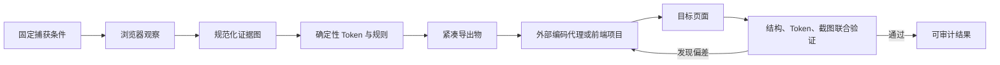

# Imprint 确定性分析与视觉验证方案

> 状态：设计提案
> 范围：确定性提取、证据质量、字号召回、报告压缩、CI drift、视觉验证
> 原则：不内置模型厂商、API Key 或 Agent CLI；外部编码代理只消费分析完成后的产物

## 1. 结论

Imprint 下一阶段不应该继续增加“解读网页”的生成式能力，而应该把浏览器已经渲染出的事实做得更完整、更稳定、更容易验证。
产品闭环应当是：



这里真正需要解决的不是“再写一遍设计描述”，而是六个可测量的问题：

1. 相同页面在相同条件下是否产生相同结果；
2. 每条结论能否追溯到真实页面、元素、视口和截图；
3. 重要文字样式是否完整召回，而不是被 DOM 均匀抽样漏掉；
4. `DESIGN.md` 是否只保留一次有用信息，同时不破坏机器可读数据；
5. CI 能否区分真实设计漂移、页面捕获失败和动态内容噪声；
6. 外部代理完成 UI 后，Imprint 能否指出具体哪里没有遵守设计系统。

## 2. 产品边界

### 2.1 Imprint 负责

- 从 Chrome/Edge 的真实渲染结果提取证据；
- 生成稳定 ID、来源、覆盖率、置信度和限制；
- 生成确定性的 Tokens、Design Profile、`DESIGN.md` 和重构简报；
- 比较两个确定性结果，识别设计漂移；
- 验证目标页面是否遵守提取出的 Token、结构规则、响应式规则和可访问性底线；
- 输出可以由人、CLI、CI 和 MCP 一致消费的结构化报告。

### 2.2 Imprint 不负责

- 调用内置大模型解释同一份报告；
- 保存厂商密钥、选择模型或执行本地编码代理；
- 猜测页面没有呈现的品牌意图；
- 自动修改用户项目；
- 用一个不透明总分掩盖不同类型的错误；
- 针对知乎或任何单一网站写专用规则。

外部 Codex、Claude 等代理仍然可以读取 Imprint 的文件或调用 MCP，但这是产物消费关系，不是分析依赖。

## 3. 当前基础与主要缺口

### 3.1 已有基础

- Desktop、CLI、MCP 共用 `src/core`，没有三套分析器；
- 已有页面健康检查、访问限制、截图完整性、页面拓扑、组件、布局、伪元素、交互、响应式和媒体证据；
- 证据使用稳定 ID，确定性 Claim Catalog 会校验引用完整性；
- 已有 15 个带人工标注的浏览器回归页面，并重复运行以检查 section ID 稳定性；
- 已有 Tokens、Design Evidence、Design Profile、组件规格、Visual QA 等结构化导出；
- 已有 token 比较和一个字节缓冲区差异原型。

### 3.2 主要缺口

- `style-extractor.ts` 对大量元素采用最多 500 个的均匀位置抽样，稀有但重要的标题、标签、弹层文字可能漏掉；
- 字号最终按频率截取前 8 个，频率高的小字号可能挤掉只出现一次的 display 字号；
- 证据、Claim、Markdown 各自存在截断逻辑，但没有统一的报告预算、遗漏清单和压缩验收；
- 当前 compare 更接近两个 Token 集合的摘要，不是可作为 CI 合同的 baseline/drift 协议；
- 当前 Visual QA 主要检查证据完整性，字节缓冲区比较也不是完整的 PNG 解码、对齐和差异产物流水线；
- 现有回归关注“是否检测到”，还没有系统计算 precision、recall、重复运行差异率和报告信息密度。

## 4. 总体架构

新增逻辑继续放在共享核心层，不复制到 Electron：

```text
src/core/
├── capture/                 # 捕获环境、稳定条件、manifest
├── analyzer/                # computed style 与 token 构建
├── design-evidence/         # 完整证据图和覆盖率
├── design-context/          # 确定性 claims/profile/brief
├── baseline/                # baseline schema、规范化和迁移
├── drift/                   # 分类比较、严重级别、结论
├── visual-validation/       # 图像、布局、结构联合验证
└── export/                  # 完整数据与紧凑视图
```

核心数据分成三层：

| 层          | 用途                              | 是否允许压缩                         |
| ----------- | --------------------------------- | ------------------------------------ |
| Observation | 浏览器原始观察记录                | 不丢失；只做规范化和去重             |
| Evidence    | 可引用、带来源和覆盖率的证据图    | 不丢失；截图单独存储                 |
| View        | DESIGN.md、摘要、CI 注释、UI 卡片 | 可以按明确预算裁剪，必须报告遗漏数量 |

任何 Markdown 都只是 Evidence 的视图，不能成为后续比较的唯一数据源。

## 5. 确定性提取与证据质量

### 5.1 捕获合同

每次分析生成 `CaptureManifest`：

```ts
interface CaptureManifest {
  schemaVersion: '1'
  browserFamily: 'chrome' | 'edge'
  browserMajor: number
  platform: string
  viewport: { width: number; height: number; deviceScaleFactor: number }
  colorScheme: 'light' | 'dark'
  reducedMotion: 'reduce'
  locale: string
  timezone: string
  fontsReady: boolean
  stabilization: {
    structuralFingerprintMatches: number
    finalNetworkQuietMs: number
    pendingFonts: number
  }
}
```

实施要求：

- 固定 viewport、device scale、locale、timezone、color scheme 和 reduced motion；
- 等待 `document.fonts.ready`，并把等待超时或后续字体加载写进限制；CSS Font Loading 规范明确说明 `ready` 在字体加载与相关布局完成后兑现；
- 页面稳定不能只依赖 `networkidle`。连续采集 DOM/布局轻量指纹，至少两次一致后才进入最终提取；
- 动画和 caret 在验证截图中关闭；分析截图保留真实页面，但把动画存在和捕获策略写进 manifest；
- 捕获失败、访问限制和真实 drift 使用不同状态，失败页面绝不能与有效 baseline 比较。

### 5.2 统一 Observation

将颜色、字号、间距等频率表升级为带来源的观察记录：

```ts
interface StyleObservation {
  property: string
  value: string
  pageId: string
  viewport: string
  elementId: string
  sectionId?: string
  role?: string
  textRole?: 'display' | 'heading' | 'body' | 'label' | 'metadata'
  visibleArea: number
  textLength?: number
  source: 'computed-style' | 'css-variable' | 'stylesheet' | 'pseudo-element'
}
```

Token 的 observation count、page count、capture count 和 confidence 全部从这张表聚合，禁止在导出阶段重新猜来源。

### 5.3 浏览器覆盖

- 保留现有 `page.evaluate` 快路径；
- 增加可开关的 CDP 审计通道，用 `DOMSnapshot.captureSnapshot` 对 iframe、template 和开放 Shadow DOM 做覆盖检查。该接口可以返回扁平 DOM、布局和白名单 computed styles，适合发现主提取器漏掉的文字节点；
- CDP 审计只报告缺口，第一阶段不直接替换主提取器，避免一次重写引入新的不稳定性；
- 伪元素、SVG、canvas 和 CSS background 继续使用不同 evidence kind，不把“看见像文字”误报成 DOM 字体；
- 所有上限都写进 coverage，例如“候选 2,430，检查 500，角色优先补采 83”，不能静默截断。

### 5.4 稳定 ID 与规范化

- ID 只由稳定输入生成：规范化 URL、viewport、语义路径、几何桶和角色；不使用 DOM 枚举顺序或时间戳；
- 集合在 hash 与导出前按稳定 key 排序；
- 对 canonical JSON 使用固定属性顺序、数字格式和 UTF-8。RFC 8785 可以作为哈希层实现参考，但不要求立刻改变面向用户的 JSON 格式；
- schema 每次变更都提供显式版本和迁移，不把提取器升级误判成网站 drift；
- 连续 10 次同环境运行要求：除截图文件路径、时间和明确标记的 volatile 字段外，canonical evidence、profile 和 Markdown 字节完全一致。

## 6. 字号召回专项

### 6.1 根因

当前“均匀抽取最多 500 个元素 + 频率前 8”会系统性偏向 DOM 中数量最多的正文和标签。一个只出现一次的 64px hero 标题，
在长列表页面上可能既没进入样本，也会在聚合时被高频小字号淘汰。这不是模型能解决的问题，而是采样与选择目标错误。

### 6.2 分层采样

改为以下候选集合的并集，再用稳定 key 去重：

1. 所有可见且具有直接文本节点的元素；
2. `h1`–`h6`、`p`、`label`、`legend`、`button`、`input`、`textarea`、`select`、导航链接和 ARIA 控件；
3. 每个 section 中字号最大、字重最高、面积最大和最常见的文字；
4. `::first-letter`、`::before`、`::after` 中实际绘制文字的伪元素；
5. 开放 Shadow DOM 与同源 iframe 中的上述候选；
6. 原有均匀样本，作为非语义结构的兜底。

隐藏判断必须同时考虑 display、visibility、opacity、有效 client rect、裁剪和祖先状态。CSSOM View 的 `getClientRects()`/Range
几何可以用来判断行内文字是否真的产生了布局盒，而不是只看元素本身尺寸。

### 6.3 字号 Token 选择

不再只取频率前 8。先构建角色槽位，再填充频率槽位：

- display：每页最大的可靠文字，最多 2 个；
- heading：按 h1–h6/heading role 和视觉显著性选 3–5 个；
- body：正文出现频率、文字长度和页面覆盖综合选 2–3 个；
- label/metadata：选 2–3 个；
- 最后用跨页高频值补足，总上限默认 12，而不是 8。

相近值只在满足明确容差时聚类，并保留原始值列表和代表值；不能凭比例补齐一套“漂亮”的 type scale。

### 6.4 字号基准集与指标

扩展现有 annotations：

```json
{
  "typography": {
    "requiredSizes": ["12px", "14px", "16px", "24px", "48px"],
    "requiredRoles": { "display": ["48px"], "body": ["16px"] },
    "forbiddenSizes": ["0px"]
  }
}
```

计算：

- exact recall = 被提取的人工标注字号 / 全部人工标注字号；
- role recall = 角色与字号都正确的数量 / 标注角色数量；
- precision = 有真实可见文字 observation 的导出字号 / 全部导出字号；
- cross-run stability = 多次运行中字号集合发生变化的次数 / 总比较次数。

首个发布门槛：fixture exact recall ≥ 98%，role recall ≥ 95%，precision = 100%，10 次重复运行稳定率 = 100%。真实网站只做监测集，
不作为 CI ground truth，因为 A/B 测试、广告和内容轮播会自行变化。

## 7. 证据质量基准

将 15 个现有 fixture 扩展为至少 40 个，覆盖：

- 长 DOM 中的稀有 hero 标题；
- Shadow DOM、同源 iframe、伪元素文字和首字下沉；
- 字体延迟加载、fallback 后替换、variable font axis；
- CSS zoom、transform、垂直书写和 CJK；
- 桌面隐藏/移动显示、reorder、container query；
- sticky、fixed、overlay、popover、dialog；
- skeleton、无限动画、时间、随机数等动态区域；
- 登录墙、验证码、错误页、空页和部分资源失败。

每类检测器都必须同时有正例和反例。只添加正例会不断提高召回，同时把误报隐藏起来。

CI 报告按 extractor 输出 precision、recall、稳定性和退化原因，不生成一个混合“质量分”。任何门槛下降都要显示具体 fixture 和 evidence ID。

## 8. 报告压缩

### 8.1 单一事实源

- `design-evidence.json` 是完整事实层；
- Design Profile 是经过确定性规则选择的 claim 层；
- `DESIGN.md`、UI 概览、CI 摘要都从同一份结构化模型渲染；
- Markdown 不再从另一段 Markdown 拼接，避免同一事实重复三次。

### 8.2 压缩规则

1. 同一 `catalogId` 在正文只渲染一次，其他章节使用短引用；
2. 相同 statement、assertion 和 evidence set 合并；
3. 低置信度 claim 不进入正文，只在 uncertainties 汇总；
4. evidence index 只列正文实际引用的 ID；
5. 相同 page/viewport 上的连续 section 事实合并为一条结构序列；
6. 完整 observation、选择前候选和本地路径只留在 Evidence JSON；
7. 每个被裁剪的集合必须输出 `shown/total` 或 machine-readable omission count；
8. 报告预算按信息类型分配，不能简单截断整个字符串。

### 8.3 初始预算

| 部分                       | 默认预算 | 超出时处理                                      |
| -------------------------- | -------: | ----------------------------------------------- |
| DESIGN.md YAML frontmatter |   32 KiB | provenance 移入 Evidence JSON，保留计数与引用   |
| 人类可读正文               |   48 KiB | 按 claim 排名裁剪并记录 omitted count           |
| Reconstruction Brief       |   24 KiB | 每个规则组设上限，保留 preserve/avoid           |
| CI job summary             |   64 KiB | 只显示最高严重级别，完整 JSON/图片作为 artifact |

`design-evidence.json` 不设内容预算；它是完整审计产物。截图继续作为外部文件引用，不编码进 JSON。

### 8.4 压缩验收

- 同一 claim 不重复渲染；
- 所有正文 evidence ID 都能解析；
- 每个被省略集合都有数量；
- lint、frontmatter round-trip 和 canonical model round-trip 全部通过；
- 与未压缩模型相比，所有 high-confidence preserve/avoid、主色、字体角色和响应式断点保持 100%；
- 以真实大页面语料统计 P50/P95 大小，预算调整基于数据，不针对某个网站写例外。

## 9. CI Design Drift

### 9.1 用户工作流

```bash
imprint baseline create https://example.com --output .imprint/baseline.json
imprint check https://preview.example.com --against .imprint/baseline.json --report .imprint/report
imprint baseline approve .imprint/report/candidate.json --output .imprint/baseline.json
```

`approve` 必须显式执行并原子替换 baseline；普通 check 永远不能自动更新基线。

### 9.2 Baseline 内容

```ts
interface DesignBaseline {
  schemaVersion: '1'
  analyzerVersion: string
  captureManifest: CaptureManifest
  source: { url: string; routes: string[] }
  canonicalEvidenceHash: string
  tokens: DesignToken
  roleSignatures: Record<string, string>
  typographySignatures: Record<string, string>
  layoutSignatures: Record<string, string>
  screenshots: Array<{ viewport: string; path: string; contentHash: string }>
  exclusions: Array<{ selector: string; reason: string }>
}
```

### 9.3 分类比较

不能只比较 hex 集合。一个颜色同时用于 background 和 text 时，集合没变也可能发生角色漂移。比较顺序：

1. 同角色 Token；
2. 同证据来源的组件/文字角色；
3. section 和 layout signature；
4. 响应式行为；
5. 规范化截图。

严重级别：

- `critical`：捕获到了错误页/登录墙却准备覆盖有效 baseline；主背景/前景角色丢失；严重对比度或横向溢出回归；
- `major`：主色角色、主要字体、关键组件、section 顺序、断点行为发生变化；
- `minor`：新增低覆盖 Token、次要间距/圆角、非关键组件变体；
- `info`：仅内容、时间、截图动态区域发生变化。

低置信度 token 默认不触发失败；某一类别证据退化时，该类别标记 `inconclusive`，不能当成无 drift。若所有可比较类别都退化，整次检查失败为“无法判断”。

### 9.4 稳定退出码

| 退出码 | 含义                                                  |
| -----: | ----------------------------------------------------- |
|      0 | stable，或只出现 policy 允许的变化                    |
|      1 | 确认的 actionable drift                               |
|      2 | capture/extraction inconclusive，不能与 baseline 比较 |
|     64 | 参数、schema 或 baseline 配置错误                     |

CI 不能把“分析器坏了”显示成“网站改版了”。

### 9.5 GitHub Actions 输出

- job summary：每个 route/viewport 的结论和最高严重级别；
- annotations：最多显示前 N 个具体变化；
- artifact：baseline、candidate、完整 drift JSON、before/after/diff 图片和日志；
- PR 评论是可选展示层，判定仍由退出码和 JSON 完成。

GitHub 官方工作流命令支持 notice/warning/error annotation，workflow artifact 适合保存测试结果和失败截图，因此不需要自建服务也能完成第一版。

## 10. 视觉验证

### 10.1 两种模式

1. `source-drift`：同一产品不同版本之间比较，回答“网站是否发生设计漂移”；
2. `implementation-conformance`：目标项目与 Imprint 设计上下文比较，回答“新 UI 是否遵守设计系统”。

第二种不是要求逐像素复制来源网站。它验证可迁移规则：颜色角色、字体角色、spacing/radius scale、组件状态、结构节奏、响应式和可访问性。

### 10.2 截图稳定化

- 固定同一 OS、浏览器 major、字体集合、viewport 和 device scale；Playwright 官方明确提示不同 OS、浏览器版本、设置和硬件会改变截图；
- 关闭动画、隐藏 caret、等待字体和结构稳定；
- 使用 CSS pixel scale；
- 支持用户显式 mask；自动检测的 volatile 区域默认只报告，不静默 mask，避免把真实变化一起遮掉；
- baseline 生成前要求两张连续截图相同，否则标记该区域或页面不稳定；
- 多 viewport 独立比较，不把 desktop 与 mobile 差异混成一个比例。

### 10.3 四层验证

| 层        | 检查                                    | 输出                            |
| --------- | --------------------------------------- | ------------------------------- |
| Token     | 颜色、字体、间距、圆角、阴影、motion    | 角色级 diff                     |
| Layout    | section/组件 rect、顺序、对齐、overflow | 标注矩形和数值变化              |
| Structure | landmark、heading、control/state        | 结构 diff；可参考 ARIA snapshot |
| Pixel     | 同尺寸截图感知差异                      | actual、expected、diff heatmap  |

Playwright 的 ARIA snapshot 可以按角色、名称、属性和顺序比较可访问结构；它适合作为像素比较的补充，但不能替代视觉 Token 和几何检查。

### 10.4 像素比较实现

当前 `comparePixelBuffers` 只适合作为算法原型。产品实现必须：

1. 解码 PNG/WebP 为统一 RGBA；
2. 验证尺寸和 device scale；
3. 输出 changed pixels、changed ratio、bounding regions；
4. 使用明确的感知色差阈值；
5. 生成透明叠加图和 heatmap；
6. 对 antialias/font rendering 噪声设独立容差；
7. 不用一个像素比例决定全部结论。

Playwright 已提供 animations、caret、mask、CSS scale、threshold、maxDiffPixels 和 maxDiffPixelRatio 等稳定化与比较参数，可作为行为基准；Imprint 使用 `playwright-core` 时可以复用同样的捕获原则，并在共享核心实现自己的报告格式。

### 10.5 验收

- 人工注入的 1px/颜色/字号/section-order/overflow 回归能定位到正确层；
- 只改变时间文本或随机头像时不会触发 major；
- 捕获环境不一致时返回 inconclusive，不给出虚假 pass；
- 每个失败都有 before、after、证据 ID、检查规则和建议检查位置；
- reduced motion、focus、error、disabled 和 24×24 CSS px target size检查独立呈现；
- 对比度按 WCAG 2.2 的普通文字 4.5:1、大文字 3:1 规则报告，并注明实际字号/字重证据。

## 11. Desktop、CLI 与 MCP 设计

### 11.1 Desktop

- 分析结果增加“可复现性”区域：捕获环境、稳定状态、覆盖率、被截断候选数；
- Theme Library 增加“建立 baseline”和“与最新分析比较”；
- 视觉验证页面展示 route × viewport 矩阵，先显示明确结论，再展示 diff；
- baseline 更新必须二次确认，并显示将被接受的具体变化；
- 设置页只增加通用的 CI/验证默认值，不增加厂商或模型设置。

### 11.2 CLI

新增命令应复用核心层：

```text
imprint baseline create <url>
imprint baseline approve <candidate>
imprint check <url> --against <baseline>
imprint validate <target-url> --context <design-evidence-or-profile>
```

所有命令支持 `--json-stdout`、稳定退出码、`--output` 和 `--quiet`。输出文件采用临时文件 + rename，失败时不损坏旧 baseline。

### 11.3 MCP

建议增加：

- `imprint_check`：返回结构化 drift，不返回大段日志；
- `imprint_validate`：返回分层验证结果和 artifact 路径；
- `imprint_evidence_get`：按 evidence ID 精确取证，避免代理一次加载完整 JSON。

MCP 不执行目标项目修改，也不调用模型。

## 12. 实施阶段

### Phase 0：基准与确定性合同（1–2 周）

- 定义 CaptureManifest、canonical evidence 和稳定字段白名单；
- 把现有 15 个 fixture 的重复运行从 ID 检查扩展为 canonical output 检查；
- 建立字号 precision/recall 统计器；
- 记录当前 P50/P95 报告大小与重复率。

完成标准：任何后续优化都能显示“改善了什么、退化了什么”，不再依靠人工看两份日志猜测。

### Phase 1：字号召回与证据覆盖（2–3 周）

- 实现文字角色优先的分层采样；
- 等待字体稳定并记录 pending font；
- 增加 Shadow DOM/iframe CDP 审计；
- 扩充 typography fixtures 与反例；
- 将字号 Token 选择改为角色槽位 + 高频补足。

完成标准：达到第 6.4 节门槛，没有新增网站域名判断。

### Phase 2：报告模型与压缩（2 周）

- 建立 typed report model；
- catalogId 去重、引用渲染、omission manifest；
- 给 frontmatter、正文、brief 和 CI summary 分配预算；
- 增加 lint、round-trip、信息保留和大小快照测试。

完成标准：P95 报告进入预算，所有 high-confidence 核心事实无损。

### Phase 3：CI drift（3 周）

- 实现 baseline schema、迁移、create/check/approve；
- 角色级 Token、typography、layout、responsive 分类 diff；
- 退化类别与 inconclusive 判定；
- JSON、退出码、GitHub annotation 和 artifact 示例 workflow。

完成标准：能够在 fixture 中区分 intentional update、真实 drift、动态噪声和捕获失败。

### Phase 4：视觉验证（3–4 周）

- PNG/WebP 解码、对齐、heatmap 和区域聚类；
- Token/Layout/Structure/Pixel 四层报告；
- source-drift 与 implementation-conformance 两种策略；
- Desktop diff viewer、CLI/MCP 接口；
- 多平台基线策略与字体环境检查。

完成标准：人工注入回归定位准确，动态内容不会造成高严重级别误报，所有失败都有可审计 artifact。

## 13. 发布门槛

每个版本必须同时满足：

- unit、typecheck、lint、desktop build、CLI build 全绿；
- Design Evidence regression 全绿；
- canonical determinism 10 次重复运行无变化；
- typography precision/recall 不低于已发布版本；
- P95 `DESIGN.md` 不突破预算；
- baseline schema round-trip 和旧版本迁移通过；
- drift fixture 的 false positive、false negative 均为 0；
- 视觉 fixture 在固定环境通过，在环境不一致时明确返回 inconclusive；
- 不包含域名、网站品牌或页面文案特判。

## 14. 竞品中值得借鉴的部分

本次本地源码检查固定在以下提交：

- Dembrandt `9dcdf74d2fa3b3c8ac824439f9697d1816017221`；
- brandmd `1191b8c38761912f2653d57a7b88df3569c3ff7b`；
- design-extract `ba56e9162d887e70496d9b0fa1c7b8a1dc7e428d`。

可直接借鉴的不是它们有没有 AI，而是这些工程决策：

- Dembrandt 有明确 baseline、阈值、退出码、GitHub annotation，并把低置信度 radius/shadow 排除出 drift；证据退化时不应得到虚假稳定结论；
- brandmd 按颜色角色比较而不是比较 hex 集合，把主要字体变化列为 major，并要求 CI 固定 viewport；无效页面 fail closed；
- design-extract 把 responsive、interaction、motion、visual diff 和 drift 当成单独能力，说明“导出 Token”之后仍有很大的确定性产品空间；
- 三者都说明：CI 能用的工具必须输出结构化变化、稳定退出码和失败证据，只有一篇更长的设计描述没有形成壁垒。

Imprint 不应复制竞品的单一总分或网站专用启发式，而应利用自己已经更完整的 Evidence graph，把每个 drift 和验证失败追溯到具体证据。

## 15. 资料依据

- [Playwright Visual Comparisons](https://playwright.dev/docs/test-snapshots)：基线截图、环境一致性、动态样式过滤和差异阈值；
- [Playwright Page Assertions](https://playwright.dev/docs/api/class-pageassertions)：animations、caret、mask、CSS scale 和 screenshot diff 参数；
- [Playwright ARIA Snapshots](https://playwright.dev/docs/aria-snapshots)：可访问结构的顺序和状态比较；
- [Chrome DevTools Protocol DOMSnapshot](https://chromedevtools.github.io/devtools-protocol/tot/DOMSnapshot/)：DOM、iframe、Shadow DOM、布局和白名单 computed styles 快照；
- [CSS Font Loading Module Level 3](https://www.w3.org/TR/css-font-loading/)：字体与布局稳定同步；
- [CSSOM View Module](https://www.w3.org/TR/cssom-view/)：client rect 和布局盒几何；
- [Design Tokens Format Module 2025.10](https://www.designtokens.org/tr/drafts/format/)：token、group、alias 和处理规则；
- [RFC 8785 JSON Canonicalization Scheme](https://www.rfc-editor.org/rfc/rfc8785.html)：可重复 JSON hash 的规范化参考；
- [WCAG 2.2](https://www.w3.org/TR/WCAG22/)：对比度、文字缩放和 target size 验证基线；
- [GitHub Actions workflow commands](https://docs.github.com/en/actions/reference/workflows-and-actions/workflow-commands)：CI annotation 与 job summary；
- [GitHub Actions workflow artifacts](https://docs.github.com/en/actions/concepts/workflows-and-actions/workflow-artifacts)：保存 diff、截图和完整报告；
- [Dembrandt drift implementation](https://github.com/dembrandt/dembrandt/blob/9dcdf74d2fa3b3c8ac824439f9697d1816017221/lib/drift.ts)；
- [Dembrandt GitHub Action](https://github.com/dembrandt/dembrandt/blob/9dcdf74d2fa3b3c8ac824439f9697d1816017221/action.yml)；
- [brandmd check implementation](https://github.com/yuvrajangadsingh/brandmd/blob/1191b8c38761912f2653d57a7b88df3569c3ff7b/src/check.js)。

## 16. 最优先的三个动作

如果一次只做三件事，顺序应该是：

1. 先完成 canonical determinism + precision/recall 基准，否则以后仍会陷入“改一次、看一次、再猜一次”的循环；
2. 再修复文字角色分层采样和字号选择，这是当前最明确、最可量化的召回缺口；
3. 然后实现 baseline/check 的结构化 drift；视觉像素层必须建立在稳定捕获和可靠证据之上。

这三个动作完成后，Imprint 的价值会从“生成一份设计报告”变成“提供可以持续信任、持续比较、持续验证的设计事实”。
