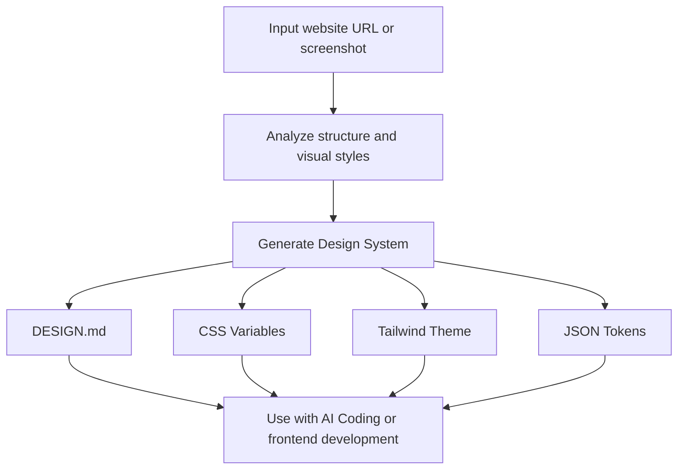

# Imprint

<p align="center">
  
</p>

> Extract visual languages from websites and screenshots, and generate reusable design systems.

Imprint is an open-source desktop application that analyzes websites and UI screenshots, extracts their visual rules (colors, typography, spacing, shadows, radii, component styles, etc.), and converts them into AI-friendly design specifications and code variables.

Make AI Coding more consistent by allowing AI agents to build interfaces based on real-world design systems instead of generating random UI styles.

[中文](./README.md)

## Why Imprint?

AI Coding makes building interfaces much easier, but maintaining a consistent product design style is still challenging.

Traditional workflow:

```
Designer
↓
Figma Design
↓
Development
```

AI era workflow:

```
Website / UI Screenshot
↓
Imprint
↓
Design System
↓
AI Agent
↓
Consistent Product UI
```

Imprint transforms real product visual languages into structured design systems that AI can understand and reuse.

## Features

### Design Language Extraction

- **Website Analysis** — Analyze visual styles from any URL
- **Screenshot Analysis** — Extract design patterns from UI screenshots
- **Design System Generation** — Extract colors, typography, spacing, shadows, radii and other design tokens
- **Visual Style Analysis** — Understand layouts, components and overall design language

### AI Coding Integration

- **AI-friendly Output** — Generate Markdown design specifications that can be used directly as AI context
- **Code Export** — Export CSS Variables, Tailwind CSS v4 `@theme`, and JSON Design Tokens
- **Agent Integration** — Works with local AI Agent CLIs such as Claude Code, Codex, Kimi and x-code-cli

### Product Experience

- **Live Theme Preview** — Apply extracted design systems to preview UI changes instantly
- **Template Showcase** — Preview generated themes with dashboard, landing page, ecommerce and blog templates
- **Built-in Themes** — Includes premium styles such as Chinese ink painting, cyberpunk, Nordic minimalism, glassmorphism and dark themes

### Privacy & Local-first

- **Local Storage** — All data is stored locally with SQLite. No account required.
- **Internationalization** — Supports English and Chinese interfaces

## Workflow



## Example Output

Imprint generates:

### DESIGN.md

Including:

- Visual style description
- Color system
- Typography rules
- Spacing system
- Border radius rules
- Shadow system
- Component guidelines

### CSS Variables

```css
:root {
  --color-primary: #2563eb;
  --radius-md: 8px;
  --spacing-lg: 24px;
}
```

### Tailwind CSS v4 Theme

```css
@theme {
  --color-primary: #2563eb;
  --radius-md: 8px;
}
```

## Tech Stack

| Layer                | Technology                                             |
| -------------------- | ------------------------------------------------------ |
| Desktop Framework    | Electron 34 + Electron Forge                           |
| Frontend             | React 19 + TypeScript + Vite                           |
| UI                   | Tailwind CSS v4                                        |
| State Management     | Zustand v5                                             |
| Storage              | SQLite (better-sqlite3)                                |
| Web Analysis         | Playwright                                             |
| Internationalization | i18next + react-i18next                                |
| AI                   | OpenAI / Claude / DeepSeek / Kimi API, Local Agent CLI |

## AI Configuration

Imprint supports two AI modes:

### 1. API Key

Configure AI providers:

- OpenAI
- Claude
- DeepSeek
- Kimi
- Other OpenAI-compatible APIs

### 2. Local Agent CLI

Automatically detects installed AI Agent tools:

- Claude Code
- Codex
- Kimi
- Gemini CLI
- OpenCode
- x-code-cli

## Development

```bash
pnpm install

pnpm dev

pnpm build

pnpm make
```

## Project Structure

```
src/
├── main/
│   ├── analyzer/
│   ├── export.ts
│   ├── database.ts
│   └── agent-detect.ts
│
└── renderer/
    ├── components/
    ├── pages/
    ├── stores/
    └── styles/
```

## License

MIT
