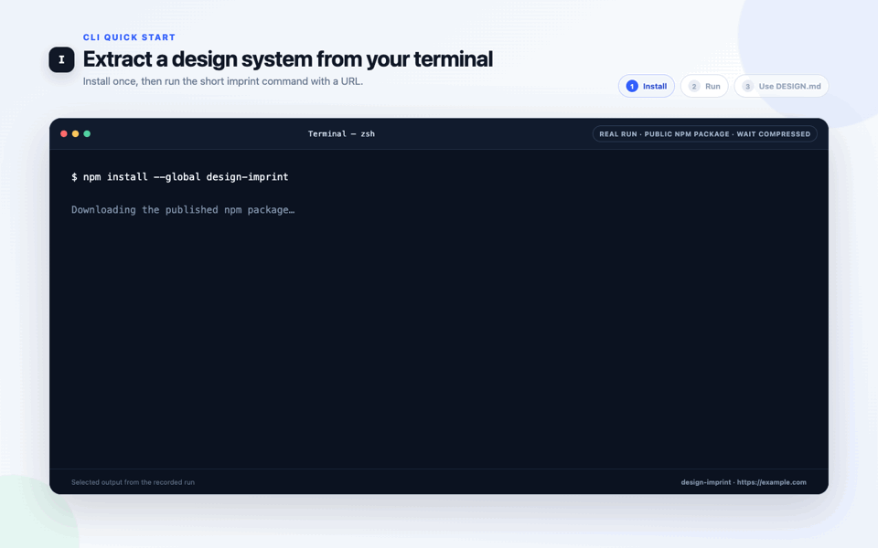
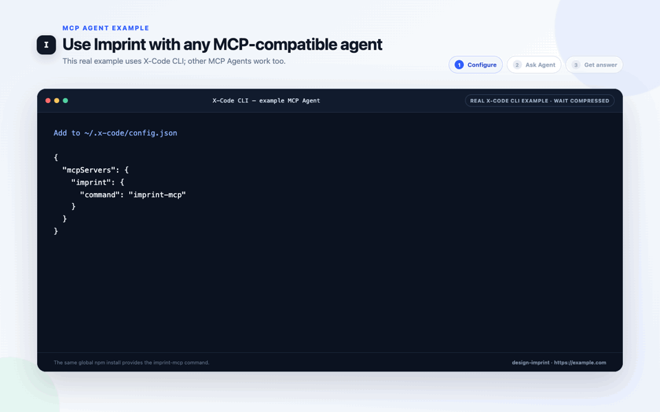

<div align="center">
  

  <h1>Imprint</h1>

  <p><strong>Extract visual languages from websites and generate reusable design systems for AI.</strong></p>

  <p>
    Extract colors, typography, spacing, radii, shadows, and component styles, then reuse the same visual language
    across multiple pages. Desktop defaults to one self-contained DESIGN.md and also exports CSS Variables
    and Tailwind v4 @theme.
    The design-imprint npm package provides standalone CLI and local MCP automation entry points without installing the
    Desktop application or cloning this repository.
  </p>

  <p>
    <a href="./README.zh-CN.md">简体中文</a>
    ·
    <a href="https://design-imprint.pages.dev">Website</a>
    ·
    <a href="https://github.com/woai3c/imprint/releases/latest">Download</a>
    ·
    <a href="#cli-and-mcp">CLI & MCP</a>
    ·
    <a href="https://www.npmjs.com/package/design-imprint">npm</a>
    ·
    <a href="#features">Features</a>
    ·
    <a href="#development">Development</a>
  </p>
</div>

<p align="center">
  
</p>

<p align="center"><sub>A real Desktop analysis rerun joined to the verified public case and its real external Codex result. The 133-second analysis wait is visibly time-compressed. <a href="./docs/media/imprint-astro-case-en.mp4">Watch the 42-second MP4</a>.</sub></p>

## What is Imprint?

Imprint is an open-source desktop application that extracts a website's visual language and turns it into a reusable
design system for AI-assisted development and frontend projects.

It observes colors, typography, spacing, border radii, shadows, layout patterns, and component styles, then generates
structured outputs that AI coding agents and frontend projects can use as implementation guidance.

AI is a downstream consumer, not an extraction dependency. Core analysis, claims, and exports are deterministic and
require no model provider, API key, or local agent runtime.

Imprint accepts website URLs as analysis input; it does not analyze standalone screenshot files. A screenshot contains
only one rendered pixel state and cannot reliably reveal the DOM hierarchy, computed styles, responsive rules, or
interaction states. The screenshots shown by Imprint and referenced by its evidence outputs are captured from the loaded
website as traceable evidence for the URL-based analysis.

Instead of relying only on an AI agent's visual guesses, give it design guidance grounded in observed website evidence.

```text
                    Website URL
                         ↓
                      Imprint
                         ↓
         Reusable Design System / DESIGN.md
                         ↓
       Claude Code / Codex / Other AI Agents
                         ↓
Multiple pages sharing the extracted visual language
```

## Why Imprint?

AI coding tools can generate interfaces quickly, but they often produce generic and inconsistent visual styles.

Prompts alone rarely preserve a design language consistently across repeated work. Imprint converts observed website
evidence into structured guidance with explicit scope, confidence, coverage, and limitations.

Export once and reuse the same design system across a product: `DESIGN.md` guides an AI agent's decisions from page to
page, while CSS Variables or a Tailwind v4 `@theme` give the implementation one shared source of visual values. This
helps a multi-page application remain visually consistent without restating the entire style in every prompt.

## Scope and boundaries

Imprint records what was actually observed, keeps the result traceable, and gives developers and external AI agents
precise design rules and values they can apply in other frontend projects.

Generated guidance covers the pages, viewports, and states that were successfully observed. `DESIGN.md` records that
coverage and its limitations so downstream agents can reuse supported rules without treating unobserved behavior as
fact. The target product's requirements and final implementation remain the responsibility of the user and their agent.

## Features

| Feature                  | Description                                                                                     |
| ------------------------ | ----------------------------------------------------------------------------------------------- |
| Website analysis         | Analyze visual styles directly from a URL                                                       |
| Diverse page discovery   | Combine navigation links and sitemaps, then sample representative same-site routes              |
| Traceable evidence       | Record page topology, section geometry, component instances, viewport coverage, and limitations |
| Token confidence         | Preserve per-token provenance, source-page coverage, and deterministic confidence               |
| Screenshot evidence      | Capture analyzed pages and viewports as traceable visual evidence                               |
| Design system generation | Generate observed colors, typography, spacing, radii, shadows, and component guidance           |
| AI-ready documentation   | Export a self-contained DESIGN.md with evidence-backed rules, scope, and limitations            |
| Code export              | Export CSS Variables and Tailwind v4 `@theme` from Desktop, CLI, or MCP                         |
| Agent integration        | Install the local CLI/MCP package for scripts and MCP-compatible coding agents                  |
| Local-first storage      | Keep analysis records and generated assets on-device; structured records use SQLite             |
| Saved website themes     | Save analysis snapshots and preview their tokens inside scoped, fixed validation scenarios      |
| Built-in themes          | Chinese ink painting, cyberpunk, Nordic minimalism, glassmorphism, and more                     |
| Validation scenarios     | Test theme hierarchy, density, and legibility across workflows and interaction states           |

## Download

Download the latest Desktop version from [GitHub Releases](https://github.com/woai3c/imprint/releases/latest). Install
the CLI and local MCP server from npm:

```bash
npm install --global design-imprint
```

Desktop analysis requires an installed Chrome, Edge, or compatible Chromium browser.

| Platform | Architecture          |
| -------- | --------------------- |
| Windows  | x64                   |
| macOS    | Apple Silicon (arm64) |
| macOS    | Intel (x64)           |

## Use with AI Coding Agents

1. Analyze a website URL with Imprint.
2. Export the generated `DESIGN.md`.
3. Copy `DESIGN.md` into your project. For a multi-page application, also export either CSS Variables or Tailwind v4
   `@theme` and load that file from the global style entry.
4. Give your AI coding agent the following instruction:

> Read DESIGN.md before implementation. Apply its Core Design Rules within their documented scope. Use Contextual Component Patterns only when the target contains the matching component and variant, and treat Local Design Observations as scoped references. Reuse the project's shared exported tokens instead of creating a separate palette or spacing scale for each page. Preserve the existing product requirements, and do not copy copyrighted text or branding from the source website.

### Public end-to-end case: Astro → Harbor Deploy

The [reproducible public case](./docs/showcase/astro/README.md) includes the captured source evidence, generated
`DESIGN.md` and CSS variables, exact agent task, neutral three-view result, browser verification record, and a
dependency-free sample you can open locally without installing Imprint. Imprint produced the design reference; the
external coding agent produced the page. The example documents one workflow, not a universal quality guarantee.

### Which format should I export?

Desktop, CLI, and MCP share `DESIGN.md`, CSS Variables, and Tailwind v4 `@theme`.
`DESIGN.md` is the default for AI workflows; CSS and Tailwind are implementation outputs. CLI/MCP additionally expose
Tokens JSON (DTCG) for structured toolchain integrations.

| Goal                                               | Recommended output                                 | Include with it                      |
| -------------------------------------------------- | -------------------------------------------------- | ------------------------------------ |
| Ask AI to revise an existing UI                    | **DESIGN.md**                                      | Current UI screenshot or source code |
| Build several pages with one visual language       | **DESIGN.md + CSS Variables or Tailwind `@theme`** | Load the code artifact globally      |
| Implement directly in a CSS project                | **CSS Variables**                                  | The existing style entry file        |
| Implement directly in a Tailwind v4 project        | **Tailwind `@theme`**                              | The project's theme stylesheet       |
| Use a CLI/MCP toolchain that needs structured data | **Tokens JSON (CLI/MCP)**                          | A precise automation task            |
| Audit how the source pages were observed (CLI/MCP) | **Design Evidence JSON**                           | The related screenshots              |

If you give AI only one exported file, choose **DESIGN.md**.

For a multi-page application, keep one `DESIGN.md` at the project root and load the exported CSS Variables or Tailwind
theme once from the global style entry. Reuse those files across pages instead of generating an unrelated token set for
each page.

Imprint's generated `DESIGN.md` follows the
[Google Labs DESIGN.md specification](https://github.com/google-labs-code/design.md), which is currently alpha. A typed
document model is rendered into its standard YAML groups and section order. The `x-imprint` extension keeps source,
coverage, analysis summaries, responsive metadata, and token groups not covered by that specification. `DESIGN.md`
contains the guidance required for normal use. For advanced automation, CLI/MCP can additionally export machine-readable
Tokens JSON and Design Evidence JSON; these formats are not part of the primary Desktop workflow.

## How extraction works

Every analysis produces deterministic browser observations: multi-viewport screenshots, page topology, normalized
section and component geometry, responsive differences, safe interaction observations, media layers, coverage, and
limitations. Program-owned rules turn those observations into stable guidance, tokens, and exports. Within the same
Imprint version, identical captured evidence produces identical results.

Imprint has no built-in model provider, API-key settings, or Agent CLI execution path. External coding agents can consume
the completed artifacts through files or MCP, but they never participate in extraction or change source facts.

## CLI and MCP

The [`design-imprint` npm package](https://www.npmjs.com/package/design-imprint) installs the `design-imprint` and
`imprint` CLI aliases plus the `imprint-mcp` local stdio server. It is versioned and released independently from the
Desktop installers.

The global npm installation downloads the published package tarball and its runtime dependencies. It does not clone
this repository, install the Desktop application, or download the project source tree. One installation provides both
the `imprint` CLI shortcut and the `imprint-mcp` server command.

Requirements: Node.js 20.19 or newer and an installed Chrome, Edge, or compatible Chromium browser. The package does
not bundle a browser.

### CLI quick start

<p align="center">
  
</p>

<p align="center"><sub>Recorded after installing the current package from npm and running <code>imprint https://example.com</code>. The real analysis wait is visibly compressed.</sub></p>

Install once, then pass a website URL to the short `imprint` command:

```bash
npm install --global design-imprint
imprint https://example.com
```

The default result is a complete `DESIGN.md` on stdout. Run `imprint doctor` if you need to check Node.js or browser
discovery. Optional formats and file output remain available for automation:

```bash
imprint https://example.com                     # DESIGN.md on stdout
imprint https://example.com --format css
imprint https://example.com --format tailwind
imprint https://example.com --format json
imprint https://example.com --format all
imprint https://example.com --format all --output ./design-all
imprint doctor --browser-path "/path/to/chrome" --json
```

### MCP quick start

<p align="center">
  
</p>

<p align="center"><sub>Imprint works with any MCP-compatible Agent. This example records X-Code CLI adding the globally installed <code>imprint-mcp</code> command, then automatically calling <code>imprint__imprint_extract</code>. The real analysis wait is visibly compressed.</sub></p>

The same global npm installation already provides `imprint-mcp`. Any Agent or host that supports local stdio MCP
servers can start this command; no X-Code-specific runtime is required.

#### X-Code CLI example

X-Code supports both its own MCP command and direct configuration. The command is more convenient; both methods start
the same local `imprint-mcp` process.

| Method                       | When to use                                           | Setup                                                            |
| ---------------------------- | ----------------------------------------------------- | ---------------------------------------------------------------- |
| X-Code command (recommended) | Normal interactive setup; avoids editing JSON by hand | Start `xc`, then run `/mcp add --scope user imprint imprint-mcp` |
| Edit the config file         | Automation or manually managed configuration          | Add the server entry below to `~/.x-code/config.json`            |

For the recommended method, run these slash commands inside the X-Code session:

```text
$ xc
> /mcp add --scope user imprint imprint-mcp
> /mcp refresh
> /mcp list
imprint    connected — 2 tools, 0 resources
```

`/mcp add` is an X-Code slash command, not a shell subcommand. `--scope user` makes the server available in every
X-Code project; use `--scope project` instead to limit it to the current project.

Alternatively, add this entry to `~/.x-code/config.json`, then run `/mcp refresh` in X-Code:

```json
{
  "mcpServers": {
    "imprint": {
      "command": "imprint-mcp"
    }
  }
}
```

Other MCP Agents follow the same pattern: use the Agent's own MCP add command when it provides one, or add
`imprint-mcp` as a local stdio server in its configuration. After connecting, ask naturally:

```text
> Use Imprint to analyze https://example.com and describe its design language.
```

In this example, X-Code discovers `imprint_extract` and `imprint_compare`, chooses the appropriate tool, and passes the
returned `DESIGN.md` to the Agent.

#### Claude Code

Add the same local stdio server directly from the shell, then verify it:

```bash
claude mcp add --scope user --transport stdio imprint -- imprint-mcp
claude mcp list
```

See the [Claude Code MCP documentation](https://code.claude.com/docs/en/mcp) for scope and server-management details.

#### Codex CLI

Add and verify the server directly from the shell:

```bash
codex mcp add imprint -- imprint-mcp
codex mcp list
```

See the [Codex MCP documentation](https://developers.openai.com/codex/mcp) for the current CLI reference.

Any other MCP-compatible Agent can use the same `imprint-mcp` stdio command; only its add command or outer
configuration shape may vary. There is no remote Imprint service. On Windows hosts that cannot resolve global npm
command shims directly, use `cmd /c imprint-mcp` as the stdio launch command.

**URL is the only required extraction parameter.** CLI returns complete `DESIGN.md` content on stdout; MCP
`imprint_extract` returns that content in its first text block. No file-read step is needed. Progress and diagnostics
stay outside the artifact (CLI stderr or MCP metadata). `extract <url>` remains an alias for a bare URL.

Neither extraction entry point saves artifacts or reuses persistent sessions by default. Captures and browser runtime
data are temporary and cleaned after success, failure, handled cancellation, and graceful transport closure. Forced
termination or a system crash cannot guarantee cleanup. Explicit `--use-session` / `useSession: true` opts into reading
and updating persistent Imprint session data; this does not implicitly save exports. `--no-session` remains accepted.

**Updating existing scripts:** add `--output .` if a script expects exports in its current directory. Callers that need
managed session reuse must enable it explicitly; MCP callers that need dark-mode observations must set `darkMode: true`.

| Output choice                                    | Inline content / filename with an explicit save directory                                        |
| ------------------------------------------------ | ------------------------------------------------------------------------------------------------ |
| `design.md` (default), alias `markdown`          | Markdown / `DESIGN.md`                                                                           |
| `css`                                            | CSS variables / `variables.css`                                                                  |
| `tailwind`                                       | Tailwind v4 `@theme` / `theme.css`                                                               |
| `json`                                           | Existing DTCG token export / `design-tokens.json`                                                |
| `scss`                                           | SCSS variables / `variables.scss`                                                                |
| `evidence`, `profile`, `components`, `visual-qa` | `design-evidence.json`, `design-profile.json`, `component-specs.json`, `visual-qa.json`          |
| `html`                                           | Printable HTML / `style-guide.html`; legacy `pdf` is an HTML alias, not a PDF renderer           |
| `all`                                            | JSON `{ artifacts: [{ format, filename, mimeType, content }] }`, or all ten artifacts when saved |

`component-specs` remains an alias for `components`. Legacy CLI `--json-stdout` (including its old `--format json`
combination) and MCP `format: "tokens"` return their existing internal-token payloads, not DTCG. They are inline-only and
reject a save destination; use standard `json` for saved token exports.

**Saving is explicit:** CLI `--output <directory>` saves only selected artifacts and leaves stdout empty. Relative paths
use the invocation working directory. MCP `outputDir` must be an absolute path on the server machine; its response is
a save manifest with absolute file paths in both `structuredContent` and a JSON text block. Existing selected files
cause an error unless `--overwrite` / `overwrite: true` is supplied; unrelated files are preserved. Referenced captures
are saved as relative assets when needed, so the output directory remains portable. Inline evidence preserves capture
metadata but marks discarded local files as `fileAvailability: "not-retained"` with an empty path.

Overwrite applies only to existing regular files, and requires an explicit output directory. Saving is not transactional:
a failed write may leave partial artifacts; the error lists paths that may have been written. Successful delivery is
reported only after temporary-data cleanup succeeds. MCP tool failures return `isError: true` and an error text block.

Both extraction entry points default to desktop viewport, up to eight pages, automatic discovery, dark-mode extraction
off, and anonymous sessions. Optional CLI `--viewport`, `--pages`, `--discovery`, `--dark-mode`, `--browser-path` map to
MCP `viewport`, `maxPages`, `discovery`, `darkMode`, `browserPath`; `viewport: "all"` selects desktop/tablet/mobile.
The page limit must be an integer from 1 to 20. `--use-session` conflicts with `--no-session`; `--quiet` suppresses
ordinary CLI progress but preserves errors and material diagnostics. Invalid formats, types, ranges, and conflicting
options fail before analysis. Example MCP arguments:

```json
{ "url": "https://example.com" }
```

Add `"format": "css"` to consume CSS directly, or `"format": "all"` and an absolute `outputDir` to save all artifacts.

The CLI and MCP server do not require an Imprint-hosted service, a running Desktop application, a model provider, or an
API key. Both run locally. The npm package requires Node.js 20.19 or newer and an installed Chrome, Edge, or compatible
Chromium executable; analyzing a public URL also requires normal network access to that website. Package installation
provides the JavaScript dependencies but does not bundle a browser.

MCP additionally requires an MCP-compatible coding agent or client. That client starts the compiled server with `node`
as a local process
and communicates with it over stdin/stdout. The word “server” refers to that local tool process; no remote deployment or
Imprint-operated server is required.

The CLI `doctor` command verifies Node.js, the operating system, browser executable access, and an actual headless launch without
navigating to a website. `--browser-path` selects an explicit Chrome, Edge, or Chromium executable for both diagnostics
and extraction; an invalid explicit path fails instead of silently falling back. The CLI uses stable exit codes: `0`
success, `2` invalid command/options, `3` missing or unusable runtime dependency, `4` capture/export/cleanup failure, and `130`
SIGINT cancellation. Doctor reports schema `1` JSON with `--json`; it diagnoses the environment but does not install a
browser.

The MCP server exposes deterministic `imprint_extract` and `imprint_compare` tools. It requires no provider credentials.
`imprint_compare` accepts either two URLs or two previously exported Design Profiles and supports token or deterministic
language-depth comparison. URL comparison retains its existing persistent capture/session behavior; the no-retained-files
default above applies to extraction. Its stdio transport writes one newline-delimited JSON-RPC message per stdout line, keeps logs
on stderr, and supports legacy lifecycle negotiation through protocol version `2025-11-25`. The compiled server is
covered by an official `@modelcontextprotocol/sdk` client contract test.

## Tech Stack

| Layer                | Technology                   |
| -------------------- | ---------------------------- |
| Desktop Framework    | Electron + Electron Forge    |
| Frontend             | React 19 + TypeScript + Vite |
| UI                   | Tailwind CSS v4              |
| State Management     | Zustand                      |
| Storage              | SQLite (better-sqlite3)      |
| Web Analysis         | Playwright                   |
| Internationalization | i18next + react-i18next      |

## Development

For AI-assisted changes, start with [AGENTS.md](AGENTS.md) and the [development workflow](docs/development/workflow.md).
The [Harness Capability Report](docs/development/harness-capabilities.md) records verified scopes and remaining setup.

```bash
# Install dependencies
pnpm install

# Start development mode
pnpm dev

# Package the app
pnpm build

# Build or install-test the publishable CLI/MCP package
pnpm check:npm-package
pnpm test:npm-package

# Build distributable (zip on Windows, DMG on macOS)
pnpm make

# Run deterministic E2E tests
pnpm test:e2e
```

## Release

From a clean `main` branch, run:

```bash
# Desktop only: vX.Y.Z
pnpm release:desktop

# CLI and MCP only: cli-vX.Y.Z
pnpm release:cli
```

Desktop and `design-imprint` use independent versions and release tags. `pnpm release:desktop` updates only the Desktop
version and changelog; its `vX.Y.Z` tag builds Windows x64 and macOS arm64/x64 installers. `pnpm release:cli` updates only
the CLI/MCP package version and changelog; its `cli-vX.Y.Z` tag tests and publishes npm plus a separate GitHub Release.
CLI/MCP releases are explicitly not marked as GitHub's latest release, so the Desktop download link remains stable.

For the first `cli-vX.Y.Z` tag, let the CLI/MCP verification and package job finish before the expected initial npm publish
failure. An npm owner then publishes that workflow's exact tarball once, configures npm Trusted Publishing for this
repository and `.github/workflows/cli-release.yml`, explicitly allows the `npm publish` action, and reruns the failed
publish job. Later CLI/MCP releases use short-lived GitHub OIDC credentials and npm provenance; they do not require a
long-lived npm token in GitHub. The first CLI changelog is anchored to Desktop tag `v0.1.2`, where this package work
began, so a later Desktop release cannot move the CLI baseline.

## Project Structure

```
src/
├── main/                # Electron main process
│   ├── analyzer/        # Web analysis engine (Electron wrapper)
│   ├── database.ts      # SQLite database
│   ├── ipc.ts           # Desktop analysis, persistence, and export handlers
│   └── preload.ts       # Typed renderer bridge
│
├── core/                # Shared extraction engine (CLI + MCP + Desktop)
│   ├── analyzer/        # Style extraction, color clustering, token building
│   ├── design-evidence/ # Stable observed evidence and coverage
│   ├── design-context/  # Validated profiles, briefs, context, validation
│   └── export/          # CSS / Tailwind / JSON / Markdown / SCSS generators
│
├── cli/                 # CLI entry point (imprint bin)
├── mcp/                 # MCP stdio server (imprint-mcp bin)
│
└── renderer/            # React frontend
    ├── components/
    ├── pages/
    ├── stores/
    └── i18n/

packages/
└── design-imprint/      # Publish manifest for the standalone npm package
```

## License

MIT
