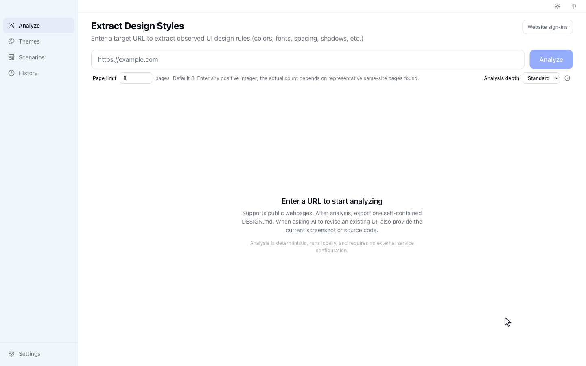
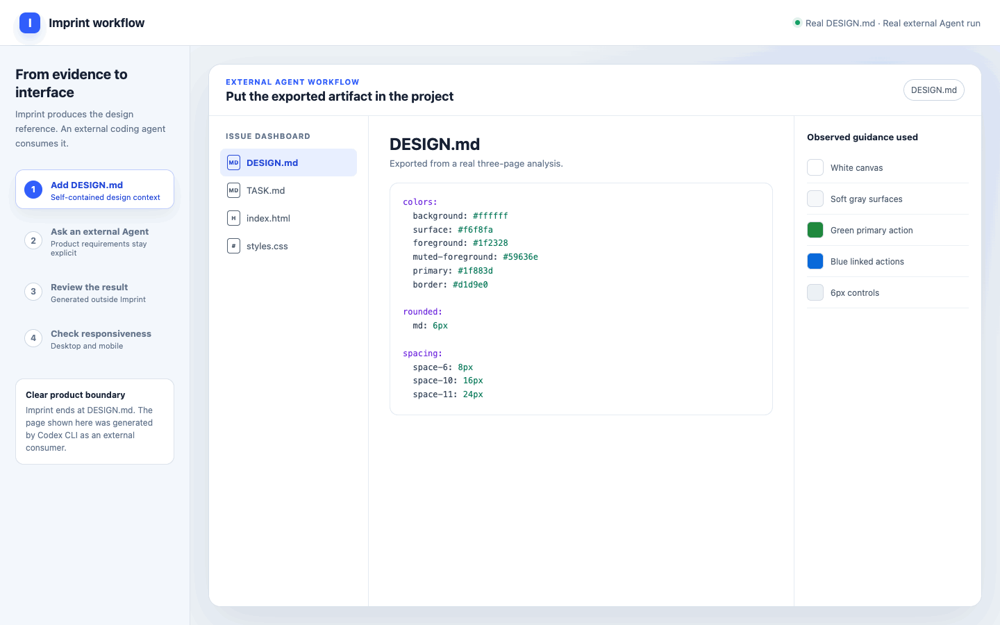

<div align="center">
  

  <h1>Imprint</h1>

  <p><strong>Extract visual languages from websites and generate reusable design systems for AI.</strong></p>

  <p>
    Extract colors, typography, spacing, radii, shadows, and component styles.
    Desktop exports one self-contained DESIGN.md. CLI and MCP automation entry points are currently available from
    source and will receive installable distribution in a later release.
  </p>

  <p>
    <a href="./README.zh-CN.md">简体中文</a>
    ·
    <a href="https://github.com/woai3c/imprint/releases/latest">Download</a>
    ·
    <a href="#features">Features</a>
    ·
    <a href="#development">Development</a>
  </p>
</div>

<p align="center">
  
</p>

<p align="center"><sub>Real Desktop analysis of three public pages. The 79-second analysis wait is visibly time-compressed.</sub></p>

## What is Imprint?

Imprint is an open-source desktop application that extracts a website's visual language and turns it into a reusable
design system for AI-assisted development and frontend projects.

It observes colors, typography, spacing, border radii, shadows, layout patterns, and component styles, then generates
structured outputs that AI coding agents and frontend projects can use as implementation guidance.

AI is a downstream consumer, not an extraction dependency. Core analysis, claims, and exports are deterministic and
require no model provider, API key, or local agent runtime.

Imprint accepts website URLs as analysis input; it does not analyze standalone screenshot files. A screenshot contains
only one rendered pixel state and cannot reliably reveal the DOM hierarchy, computed styles, responsive rules, or
interaction states. The screenshots shown by Imprint and referenced by its evidence outputs are captured from the loaded
website as traceable evidence for the URL-based analysis.

Instead of relying only on an AI agent's visual guesses, give it design guidance grounded in observed website evidence.

```text
Website URL
        ↓
      Imprint
        ↓
Reusable Design System / DESIGN.md
        ↓
Claude Code / Codex / Other AI Agents
        ↓
Interfaces that reuse the extracted visual language
```

## Why Imprint?

AI coding tools can generate interfaces quickly, but they often produce generic and inconsistent visual styles.

Prompts alone rarely preserve a design language consistently across repeated work. Imprint converts observed website
evidence into structured guidance with explicit scope, confidence, coverage, and limitations.

## Goal and scope

Imprint's goal is to make a website's visual language reusable. It records what was actually observed, keeps the result
traceable, and gives external AI agents precise design rules and values they can apply in other frontend projects.

Generated guidance covers the pages, viewports, and states that were successfully observed. `DESIGN.md` records that
coverage and its limitations so downstream agents can reuse supported rules without treating unobserved behavior as
fact. The target product's requirements and final implementation remain the responsibility of the user and their agent.

## Features

| Feature                  | Description                                                                                     |
| ------------------------ | ----------------------------------------------------------------------------------------------- |
| Website analysis         | Analyze visual styles directly from a URL                                                       |
| Diverse page discovery   | Combine navigation links and sitemaps, then sample representative same-site routes              |
| Traceable evidence       | Record page topology, section geometry, component instances, viewport coverage, and limitations |
| Token confidence         | Preserve per-token provenance, source-page coverage, and deterministic confidence               |
| Screenshot evidence      | Capture analyzed pages and viewports as traceable visual evidence                               |
| Design system generation | Generate observed colors, typography, spacing, radii, shadows, and component guidance           |
| AI-ready documentation   | Export Google DESIGN.md alpha with traceable Imprint extensions                                 |
| Code export              | Source-built CLI/MCP export CSS Variables, Tailwind CSS v4 themes, and JSON Design Tokens       |
| Agent integration        | Use Desktop artifacts now; installable local MCP distribution is planned for the next stage     |
| Local-first storage      | Store project data locally with SQLite                                                          |
| Saved website themes     | Save analysis snapshots and preview their tokens inside scoped, fixed validation scenarios      |
| Built-in themes          | Chinese ink painting, cyberpunk, Nordic minimalism, glassmorphism, and more                     |
| Validation scenarios     | Test theme hierarchy, density, and legibility across workflows and interaction states           |

## Use with AI Coding Agents

1. Analyze a website URL with Imprint.
2. Export the generated `DESIGN.md`.
3. Copy `DESIGN.md` into your project.
4. Give your AI coding agent the following instruction:

> Read DESIGN.md before implementation. Apply its Core Design Rules within their documented scope. Use Contextual Component Patterns only when the target contains the matching component and variant, and treat Local Design Observations as scoped references. Preserve the existing product requirements, and do not copy copyrighted text or branding from the source website.

<p align="center">
  
</p>

<p align="center"><sub>This is a real external Codex CLI run using the exported DESIGN.md and a fixed product task. Imprint produced the design reference; it did not generate the page. The example demonstrates the workflow, not a universal quality guarantee.</sub></p>

### Which format should I export?

The Desktop AI workflow exports one complete `DESIGN.md`. Source-built CLI and MCP entry points additionally expose the
specialized formats below for automation and implementation workflows; their installable distribution is planned for a
later release.

| Goal                                                   | Recommended output       | Include with it                      |
| ------------------------------------------------------ | ------------------------ | ------------------------------------ |
| Ask AI to revise an existing UI                        | **DESIGN.md**            | Current UI screenshot or source code |
| Implement directly in a CSS project                    | **CSS Variables**        | The existing style entry file        |
| Implement directly in a Tailwind v4 project            | **Tailwind `@theme`**    | The project's theme stylesheet       |
| Use a toolchain or an agent that needs structured data | **Tokens JSON**          | A precise automation task            |
| Audit how the source pages were observed               | **Design Evidence JSON** | The related screenshots              |

If you give AI only one exported file, choose **DESIGN.md**.

Imprint's generated `DESIGN.md` follows the [Google Labs DESIGN.md alpha specification](https://github.com/google-labs-code/design.md): a typed document model is rendered into the normative YAML groups and canonical section order. The summarized `x-imprint` extension keeps source, coverage, analysis summaries, responsive metadata, and token groups not covered by the alpha schema; complete token provenance remains in Tokens JSON and `design-evidence.json`.

## Deterministic design context

Every analysis produces deterministic `DesignEvidence`: multi-viewport screenshots, page topology, normalized section
and component geometry, responsive differences, safe interaction observations, media layers, coverage, and limitations.
Program-owned rules turn that evidence into a stable, traceable Design Profile, Reconstruction Brief, validation recipe,
and exports. Identical captured evidence produces identical context.

Imprint has no built-in model provider, API-key settings, or Agent CLI execution path. External coding agents can consume
the completed artifacts through files or MCP, but they never participate in extraction or change source facts.

## CLI and MCP

> **Release status:** GitHub Releases currently distribute the Desktop application only. The CLI and local stdio MCP
> server are implemented and tested source-build previews. Installable packages and supported MCP client setup will be
> released in the next product stage; they are not included in the current Desktop installers.

```bash
pnpm build:cli
imprint doctor
imprint doctor --browser-path "/path/to/chrome" --json
imprint extract https://example.com --viewport all --format evidence
imprint extract https://example.com --pages 5 --discovery auto --format json
imprint extract https://example.com --viewport all --format profile
```

The CLI and MCP server do not require an Imprint-hosted service, a running Desktop application, a model provider, or an
API key. Both run locally. Source builds currently require Node.js 20.19 or newer and an installed Chrome, Edge, or
compatible Chromium executable; analyzing a public URL also requires normal network access to that website. A future
package install will provide the JavaScript dependencies, but it will not bundle the browser.

MCP additionally requires an MCP-compatible coding agent or client. That client starts `imprint-mcp` as a local process
and communicates with it over stdin/stdout. The word “server” refers to that local tool process; no remote deployment or
Imprint-operated server is required.

`imprint doctor` verifies Node.js, the operating system, browser executable access, and an actual headless launch without
navigating to a website. `--browser-path` selects an explicit Chrome, Edge, or Chromium executable for both diagnostics
and extraction; an invalid explicit path fails instead of silently falling back. The CLI uses stable exit codes: `0`
success, `2` invalid command/options, `3` missing or unusable runtime dependency, `4` capture/export failure, and `130`
SIGINT cancellation. Doctor reports schema `1` JSON with `--json`; it diagnoses the environment but does not install a
browser.

The MCP server exposes deterministic `imprint_extract` and `imprint_compare` tools. It requires no provider credentials.
`imprint_compare` accepts either two URLs or two previously exported Design Profiles and supports token or deterministic
language-depth comparison. Its stdio transport writes one newline-delimited JSON-RPC message per stdout line, keeps logs
on stderr, and supports legacy lifecycle negotiation through protocol version `2025-11-25`. The compiled server is
covered by an official `@modelcontextprotocol/sdk` client contract test.

## Download

Download the latest Desktop version from [GitHub Releases](https://github.com/woai3c/imprint/releases/latest). CLI and
MCP installable packages are planned for a later release.

| Platform | Architecture          |
| -------- | --------------------- |
| Windows  | x64                   |
| macOS    | Apple Silicon (arm64) |
| macOS    | Intel (x64)           |

## Tech Stack

| Layer                | Technology                   |
| -------------------- | ---------------------------- |
| Desktop Framework    | Electron + Electron Forge    |
| Frontend             | React 19 + TypeScript + Vite |
| UI                   | Tailwind CSS v4              |
| State Management     | Zustand                      |
| Storage              | SQLite (better-sqlite3)      |
| Web Analysis         | Playwright                   |
| Internationalization | i18next + react-i18next      |

## Development

```bash
# Install dependencies
pnpm install

# Start development mode
pnpm dev

# Package the app
pnpm build

# Build distributable (zip on Windows, DMG on macOS)
pnpm make

# Run deterministic E2E tests
pnpm test:e2e
```

## Release

From a clean `main` branch, run:

```bash
pnpm release
```

The release command runs the repository checks, updates the version and changelog, creates an annotated version tag,
and pushes it after confirmation. The tag currently triggers Desktop-only Windows x64 and macOS arm64/x64 builds in
GitHub Actions. CLI and MCP package publication will be added in a later stage.

## Project Structure

```
src/
├── main/                # Electron main process
│   ├── analyzer/        # Web analysis engine (Electron wrapper)
│   ├── database.ts      # SQLite database
│   ├── ipc.ts           # Desktop analysis, persistence, and export handlers
│   └── preload.ts       # Typed renderer bridge
│
├── core/                # Shared extraction engine (CLI + MCP + Desktop)
│   ├── analyzer/        # Style extraction, color clustering, token building
│   ├── design-evidence/ # Stable observed evidence and coverage
│   ├── design-context/  # Validated profiles, briefs, context, validation
│   └── export/          # CSS / Tailwind / JSON / Markdown / SCSS generators
│
├── cli/                 # CLI entry point (imprint bin)
├── mcp/                 # MCP stdio server (imprint-mcp bin)
│
└── renderer/            # React frontend
    ├── components/
    ├── pages/
    ├── stores/
    └── i18n/
```

## License

MIT
