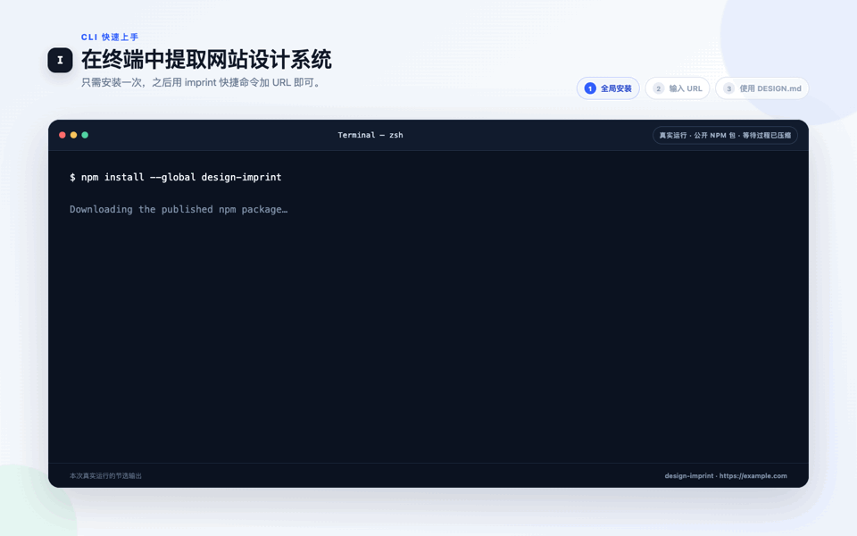
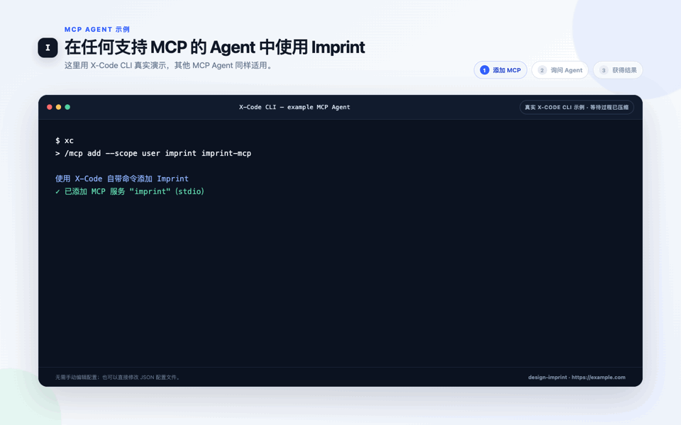

<div align="center">
  

  <h1>印记 · Imprint</h1>

  <p><strong>从目标网站提取视觉语言，生成可供 AI 复用的设计系统。</strong></p>

  <p>
    提取颜色、字体、间距、圆角、阴影和组件风格，再将同一套视觉语言复用于多个页面。
    Desktop 默认导出一份完整的 DESIGN.md，也支持 CSS Variables 和 Tailwind v4 @theme。
    design-imprint npm 包提供独立的 CLI 与本地 MCP 自动化入口，无需安装 Desktop，也不会克隆本仓库源码。
  </p>

  <p>
    <a href="./README.md">English</a>
    ·
    <a href="https://design-imprint.pages.dev/zh-CN/">官网</a>
    ·
    <a href="https://github.com/woai3c/imprint/releases/latest">下载安装</a>
    ·
    <a href="#cli-与-mcp">CLI 与 MCP</a>
    ·
    <a href="https://www.npmjs.com/package/design-imprint">npm</a>
    ·
    <a href="#功能">功能</a>
    ·
    <a href="#开发">开发</a>
  </p>
</div>

<p align="center">
  
</p>

<p align="center"><sub>真实 Desktop 复跑与已验收的公开案例、真实外部 Codex 结果剪辑在一起；本次分析实际等待 44 秒，GIF 中已明确压缩。<a href="./docs/media/imprint-astro-case-zh-CN.mp4">观看 40 秒 MP4</a>。</sub></p>

## Imprint 是什么？

Imprint 是一个开源桌面应用，可以提取目标网站的视觉语言，并将其转换成可供 AI 辅助开发和前端项目复用的设计系统。

它会观察颜色、字体、间距、圆角、阴影、布局规律和组件风格，并生成可供 AI Coding Agent 和前端项目参考实施的结构化输出。

AI 是这些输出的下游使用者，不是提取过程的依赖。核心分析、声明和导出由确定性程序完成，不需要模型厂商、
API Key 或本地 Agent 运行时。

Imprint 仅接受网站 URL 作为分析输入，不支持分析独立的截图文件。截图只包含某个时刻渲染后的像素，无法可靠还原
DOM 层级、计算样式、响应式规则或交互状态。Imprint 展示并在证据输出中引用的截图，由分析器从已加载的网站中
自动捕获，作为 URL 分析的可追溯视觉证据。

不只依赖 AI 对视觉风格的猜测，而是为它提供建立在真实网页观察证据上的设计指导。

```text
             网站 URL
                 ↓
              Imprint
                 ↓
    可复用设计系统 / DESIGN.md
                 ↓
Claude Code / Codex / 其他 AI Agent
                 ↓
 共享所提取视觉语言的多个产品页面
```

## 为什么需要 Imprint？

AI Coding 可以快速生成界面，但生成结果可能依赖模型已有认知和临时判断，也可能难以在多个页面之间保持一致。

单靠提示词很难持续传递一套设计语言。Imprint 将真实网站中观察到的证据转换成结构化指导，并明确记录其适用范围、
置信度、覆盖情况和局限。

一次导出即可在整个产品中复用同一套设计系统：`DESIGN.md` 指导 AI Agent 在不同页面中延续相同的设计决策，CSS Variables
或 Tailwind v4 `@theme` 则为代码提供统一的视觉变量来源。这样无需在每次提示中重新描述整套风格，也能帮助多页面应用
保持视觉一致。

## 能力边界

Imprint 记录实际观察结果、保留可追溯性，并为开发者和外部 AI Agent 提供能够应用到其他前端项目中的设计规则和精确值。

生成的设计指导只覆盖成功观察到的页面、视口和状态。`DESIGN.md` 会记录覆盖范围和局限，帮助下游 Agent 复用有证据支持的
规则，而不把未观察到的行为当成事实。目标产品的业务需求和最终实现仍由用户及其选择的 Agent 决定。

## 功能

| 功能           | 说明                                                                |
| -------------- | ------------------------------------------------------------------- |
| 网站分析       | 输入 URL，自动分析网页视觉风格                                      |
| 多样化页面发现 | 联合导航链接与 sitemap，选择有代表性的同站页面                      |
| 可追溯证据     | 记录页面拓扑、区块几何、组件实例、视口覆盖和证据限制                |
| Token 置信度   | 保存每个 token 的来源、页面覆盖和确定性置信度                       |
| 截图证据       | 自动捕获已分析页面和视口，作为可追溯的视觉证据                      |
| 设计系统生成   | 提取已观察到的颜色、字体、间距、圆角、阴影和组件风格                |
| AI 友好文档    | 导出包含证据规则、适用范围和局限的完整 DESIGN.md                    |
| 代码导出       | Desktop、CLI 与 MCP 均可导出 CSS Variables 和 Tailwind v4 `@theme`  |
| Agent 集成     | 安装本地 CLI/MCP 软件包，接入脚本和支持 MCP 的 Coding Agent         |
| 本地优先存储   | 分析记录与生成资源均保存在本机，结构化记录使用 SQLite，无需注册账号 |
| 网站主题库     | 保存分析快照，并在隔离的固定验证场景中预览其设计令牌                |
| 内置主题       | 国风山水、赛博朋克、极简北欧、毛玻璃等多种设计风格                  |
| 验证场景       | 在工作流、内容展示与交互状态中检验主题的层级、密度和可读性          |

## 下载安装

从 [GitHub Releases](https://github.com/woai3c/imprint/releases/latest) 下载最新 Desktop 版本。CLI 与本地 MCP
服务器通过 npm 安装：

```bash
npm install --global design-imprint
```

Desktop 分析需要本机安装 Chrome、Edge 或兼容的 Chromium 浏览器。

| 平台    | 架构                  |
| ------- | --------------------- |
| Windows | x64                   |
| macOS   | Apple Silicon (arm64) |
| macOS   | Intel (x64)           |

## 与 AI Coding Agent 配合使用

1. 使用 Imprint 分析网站 URL。
2. 导出生成的 `DESIGN.md`。
3. 将 `DESIGN.md` 放到目标项目中。对于多页面应用，同时导出 CSS Variables 或 Tailwind v4 `@theme`，并从全局样式
   入口加载该文件。
4. 给 AI Coding Agent 以下指令：

> 实现前先阅读 DESIGN.md。在文档声明的范围内采用“核心设计规则”；只有目标页面出现对应组件和变体时，才使用“场景化组件模式”；“局部设计观察”仅作为相符场景下的参考。复用项目已导出的共享 Token，不要为每个页面分别创建新的色板或间距体系。保留当前产品需求，不要复制来源网站的品牌、文案和受版权保护的内容。

### 公开端到端案例：Astro → Harbor Deploy

[可复现公开案例](./docs/showcase/astro/README.zh-CN.md)包含自动捕获的来源证据、生成的 `DESIGN.md` 与 CSS Variables、
固定 Agent 任务、中性三页面结果、浏览器验收记录，以及无需安装 Imprint 即可在本地打开的无依赖样例包。Imprint
生成设计参考，外部 Coding Agent 生成页面；该案例记录一次真实工作流，不代表普遍质量保证。

### 应该导出哪一种？

Desktop、CLI 与 MCP 共用 `DESIGN.md`、CSS Variables 和 Tailwind v4 `@theme`。`DESIGN.md` 是 AI 工作流的
默认产物；CSS 和 Tailwind 是直接实现所需的辅助产物。CLI/MCP 另外提供 Tokens JSON（DTCG）供结构化工具链使用。

| 目标                                  | 推荐输出                                           | 一起提供             |
| ------------------------------------- | -------------------------------------------------- | -------------------- |
| 让 AI 修改已有 UI                     | **DESIGN.md**                                      | 当前 UI 截图或源代码 |
| 使用同一视觉语言构建多个页面          | **DESIGN.md + CSS Variables 或 Tailwind `@theme`** | 全局加载代码产物     |
| 直接在 CSS 项目中实现                 | **CSS Variables**                                  | 现有样式入口文件     |
| 直接在 Tailwind v4 项目中实现         | **Tailwind `@theme`**                              | 项目的主题样式文件   |
| 交给需要结构化数据的 CLI/MCP 工具链   | **Tokens JSON（CLI/MCP）**                         | 具体的自动化任务说明 |
| 审计来源页面的实际观察范围（CLI/MCP） | **Design Evidence JSON**                           | 对应页面截图         |

如果只给 AI 一个导出文件，请选择 **DESIGN.md**。

对于多页面应用，建议在项目根目录保留一份 `DESIGN.md`，并从全局样式入口加载导出的 CSS Variables 或 Tailwind
主题。所有页面复用这些文件，不要在没有明确需要不同视觉语言时为每个页面生成互不相关的 Token。

Imprint 生成的 `DESIGN.md` 遵循目前仍处于 alpha 阶段的
[Google Labs DESIGN.md 规范](https://github.com/google-labs-code/design.md)。程序先构建类型化文档模型，再按其标准 YAML
分组和章节顺序渲染。`x-imprint` 扩展保留来源、覆盖率、分析摘要、响应式元数据和该规范暂未覆盖的令牌。
`DESIGN.md` 已包含正常使用所需的设计指导。对于高级自动化，CLI/MCP 还可导出机器可读的 Tokens JSON 和用于
底层观察审计的 Design Evidence JSON；这两种格式不属于 Desktop 的主要工作流。

## 提取原理

每次分析都会生成确定性的浏览器观察：多视口截图、页面拓扑、归一化区块与组件几何、响应式差异、安全交互观察、
媒体层、覆盖范围和限制。程序规则再将这些观察转换为稳定的设计指导、Token 和导出物。在相同 Imprint 版本下，
相同的捕获证据会生成相同结果。

Imprint 不包含模型厂商、API Key 设置或 Agent CLI 执行路径。外部 Coding Agent 可以通过文件或 MCP 使用分析完成后的
产物，但不会参与提取，也不能改变来源事实。

## CLI 与 MCP

[`design-imprint` npm 包](https://www.npmjs.com/package/design-imprint)会安装 `design-imprint`、`imprint` 两个
CLI 别名，以及本地 stdio 服务 `imprint-mcp`。它与 Desktop 安装包独立发版、独立维护版本。

npm 全局安装只下载已发布的软件包 tarball 和运行依赖，不会克隆本仓库、安装 Desktop，也不会下载整个项目源码。
一次安装会同时提供 `imprint` CLI 快捷命令和 `imprint-mcp` 服务命令。

运行要求：Node.js 20.19 或更高版本，以及本机已安装的 Chrome、Edge 或兼容 Chromium 浏览器。npm 包不会捆绑浏览器。

### CLI 快速上手

<p align="center">
  
</p>

<p align="center"><sub>从 npm 安装当前版本后，真实执行 <code>imprint https://example.com</code> 录制；动图中已明确压缩分析等待时间。</sub></p>

只需安装一次，之后把网站 URL 交给简短的 `imprint` 命令：

```bash
npm install --global design-imprint
imprint https://example.com
```

默认会在 stdout 返回完整的 `DESIGN.md`。需要检查 Node.js 或浏览器发现情况时可运行 `imprint doctor`。
自动化场景仍可选择其他格式或保存目录：

```bash
imprint https://example.com                     # 在 stdout 返回 DESIGN.md
imprint https://example.com --format css
imprint https://example.com --format tailwind
imprint https://example.com --format json
imprint https://example.com --format all
imprint https://example.com --format all --output ./design-all
imprint doctor --browser-path "/path/to/chrome" --json
```

### MCP 快速上手

<p align="center">
  
</p>

<p align="center"><sub>Imprint 可以接入任何支持 MCP 的 Agent；这里仅使用 X-Code CLI 录制一个真实示例：启动全局安装的 <code>imprint-mcp</code>，并根据自然语言请求自动调用 <code>imprint__imprint_extract</code>。动图中已明确压缩分析等待时间。</sub></p>

同一次 npm 全局安装已经提供 `imprint-mcp`。任何支持本地 stdio MCP 服务的 Agent 或宿主都可以启动这个命令，
不依赖 X-Code 专用运行时。下面只是以 X-Code CLI 为具体示例，将配置加入 `~/.x-code/config.json`：

```json
{
  "mcpServers": {
    "imprint": {
      "command": "imprint-mcp"
    }
  }
}
```

启动 X-Code 后直接用自然语言提出需求，用户只需提供 URL：

```text
$ xc
> 请使用 Imprint 分析 https://example.com，并告诉我它的设计语言。
```

在这个示例中，X-Code 会发现 `imprint_extract` 和 `imprint_compare`，自动选择工具，并把返回的 `DESIGN.md`
交给 Agent。其他任何支持 MCP 的 Agent 都可以使用同一个 `"command": "imprint-mcp"` 服务条目，区别通常只在
最外层配置格式。整个过程不需要远程 Imprint 服务。Windows 宿主如果不能直接解析全局 npm 命令 shim，可使用
`"command": "cmd"` 和 `"args": ["/c", "imprint-mcp"]`。

**URL 是唯一必填的提取参数。** CLI 在 stdout 直接输出完整 `DESIGN.md` 正文，MCP `imprint_extract`
在首个文本块中返回正文，不需要再读取文件。进度和诊断放在产物之外（CLI stderr 或 MCP 元数据）。
`extract <url>` 仍可作为直接传 URL 的等价调用方式。

两个提取入口默认都不保存产物，也不复用持久会话。截图和浏览器运行数据只临时使用，
在成功、失败、已处理的取消和正常连接关闭后清理；强制终止或系统崩溃不能保证清理。
显式 `--use-session` / `useSession: true` 才允许读取和更新 Imprint 持久会话数据，
该选项不会隐式保存导出文件。继续接受 `--no-session`。

**更新已有脚本：** 如果脚本依赖当前目录中的导出文件，请增加 `--output .`。
需要复用托管会话时必须显式启用；MCP 调用需要暗色模式观察时，请设置 `darkMode: true`。

| 格式选择                                         | 直接返回的内容 / 显式保存时的文件名                                                         |
| ------------------------------------------------ | ------------------------------------------------------------------------------------------- |
| `design.md`（默认），别名 `markdown`             | Markdown / `DESIGN.md`                                                                      |
| `css`                                            | CSS 变量 / `variables.css`                                                                  |
| `tailwind`                                       | Tailwind v4 `@theme` / `theme.css`                                                          |
| `json`                                           | 现有 DTCG Token 导出 / `design-tokens.json`                                                 |
| `scss`                                           | SCSS 变量 / `variables.scss`                                                                |
| `evidence`、`profile`、`components`、`visual-qa` | `design-evidence.json`、`design-profile.json`、`component-specs.json`、`visual-qa.json`     |
| `html`                                           | 可打印 HTML / `style-guide.html`；旧版 `pdf` 是 HTML 别名，并非 PDF 渲染器                  |
| `all`                                            | JSON `{ artifacts: [{ format, filename, mimeType, content }] }`，指定目录则保存全部十种产物 |

保留 `component-specs` 作为 `components` 的别名。旧版 CLI `--json-stdout`（包括已有的 `--format json`
组合）和 MCP `format: "tokens"` 继续返回各自的内部 Token 结构，而非 DTCG。
这两个兼容入口仅直接返回内容，与保存目录同时使用时报错；保存 Token 导出请使用标准 `json` 格式。

**只有显式指定目录才保存：** CLI `--output <目录>` 只保存所选产物，stdout 保持为空，
相对路径以调用时的工作目录为基准。MCP `outputDir` 必须是服务进程所在机器上的绝对路径；
响应在 `structuredContent` 和 JSON 文本块中返回包含绝对文件路径的保存清单。
目标文件已存在时默认报错，只有 `--overwrite` / `overwrite: true` 才覆盖所选文件，无关文件保持不变。
产物引用的截图按需保存为相对路径资源，便于移动整个目录。
直接返回的证据保留截图元数据，但将已丢弃的本地文件标记为 `fileAvailability: "not-retained"`，路径为空。

覆盖选项仅适用于已有的普通文件，且必须显式提供输出目录。保存操作不具备事务性：
写入失败可能留下不完整产物，错误信息会列出可能已写入的路径。只有临时数据清理成功后才报告交付成功。
MCP 工具执行失败时返回 `isError: true` 和错误文本块。

两个提取入口默认使用 desktop 视口、最多八页、自动发现、关闭暗色提取和匿名会话。
可选 CLI 参数 `--viewport`、`--pages`、`--discovery`、`--dark-mode`、`--browser-path`
分别对应 MCP `viewport`、`maxPages`、`discovery`、`darkMode`、`browserPath`；
`viewport: "all"` 选择 desktop/tablet/mobile。页面数量上限必须是 1 到 20 的整数。
`--use-session` 与 `--no-session` 冲突；`--quiet` 隐藏普通 CLI 进度，但仍保留错误和重要诊断。
错误格式、类型、范围和冲突参数会在分析前被拒绝。
最简 MCP 参数示例：

```json
{ "url": "https://example.com" }
```

增加 `"format": "css"` 可直接消费 CSS，增加 `"format": "all"` 和绝对路径 `outputDir` 可保存全部产物。

CLI 与 MCP 不依赖 Imprint 托管服务、正在运行的 Desktop 应用、模型厂商或 API Key，二者都在用户电脑本地运行。
npm 包需要 Node.js 20.19 或更高版本，以及本机已安装的 Chrome、Edge 或兼容的 Chromium；分析公网 URL 时还需要
能够正常访问目标网站。软件包会安装所需的 JavaScript 依赖，但不会捆绑浏览器。

MCP 还需要支持 MCP 的 Coding Agent 或客户端。客户端会使用 `node` 在本地启动编译后的服务，并通过 stdin/stdout 与其
通信。这里的“服务器”只是本地工具进程，不需要远程部署，也不需要由 Imprint 运营服务器。

CLI 的 `doctor` 命令会检查 Node.js、操作系统、浏览器可执行文件，并实际启动一次无页面导航的 headless 浏览器。
`--browser-path` 可以明确指定 Chrome、Edge 或 Chromium；无效的显式路径会直接失败，不会静默回退。CLI 使用稳定退出码：
`0` 表示成功，`2` 表示命令或参数错误，`3` 表示运行环境依赖缺失或不可用，`4` 表示捕获、导出或清理失败，`130` 表示 SIGINT 取消。

MCP 服务器提供确定性的 `imprint_extract` 与 `imprint_compare` 工具，不需要任何厂商凭据。`imprint_compare` 可以接收
两个 URL 或两个已经导出的 Design Profile，并按 token 或确定性设计语言进行比较。
URL 比较保留现有的截图和会话持久化行为；上述默认不保留文件的约定适用于提取。

## 技术栈

| 层级     | 技术                         |
| -------- | ---------------------------- |
| 桌面框架 | Electron + Electron Forge    |
| 前端     | React 19 + TypeScript + Vite |
| UI       | Tailwind CSS v4              |
| 状态管理 | Zustand                      |
| 数据存储 | SQLite (better-sqlite3)      |
| 网页分析 | Playwright                   |
| 国际化   | i18next + react-i18next      |

## 开发

使用 AI 辅助开发时，从 [AGENTS.md](AGENTS.md) 和[开发流程](docs/development/workflow.md)开始。
[Harness 能力报告](docs/development/harness-capabilities.md)列出了已验证的作用域和待完成的配置。

```bash
# 安装依赖
pnpm install

# 启动开发模式
pnpm dev

# 打包应用
pnpm build

# 构建或安装验证可发布的 CLI/MCP 包
pnpm check:npm-package
pnpm test:npm-package

# 构建分发包（Windows 输出 zip，macOS 输出 DMG）
pnpm make

# 运行确定性 E2E 测试
pnpm test:e2e
```

## 发布

在干净的 `main` 分支执行：

```bash
# 仅发布 Desktop：vX.Y.Z
pnpm release:desktop

# 仅发布 CLI 与 MCP：cli-vX.Y.Z
pnpm release:cli
```

Desktop 与 `design-imprint` 使用相互独立的版本和发布标签。`pnpm release:desktop` 只更新 Desktop 版本与
changelog；其 `vX.Y.Z` 标签构建 Windows x64、macOS arm64 和 macOS x64 安装包。`pnpm release:cli` 只更新
CLI/MCP 软件包版本与 changelog；其 `cli-vX.Y.Z` 标签验证并发布 npm，同时创建单独的 GitHub Release。
CLI/MCP Release 明确不会被标记为 GitHub 的 Latest，因此 Desktop 下载链接不会被 npm tarball 替代。

首次推送 `cli-vX.Y.Z` 标签时，应先让 CLI/MCP 验证和软件包任务全部完成；发布任务会因为尚未配置 Trusted
Publisher 而按预期失败。npm 所有者随后只发布该次工作流生成的 tarball，为本仓库及
`.github/workflows/cli-release.yml` 配置 npm Trusted Publishing，明确允许 `npm publish` 操作，再重跑失败的
发布任务。后续 CLI/MCP 发布使用 GitHub OIDC 短期凭据和 npm provenance，不需要在 GitHub 中保存长期 npm token。
首次 CLI changelog 固定以开始引入该软件包的 Desktop 标签 `v0.1.2` 为基线，因此后续 Desktop 发布不会移动 CLI 基线。

## 项目结构

```
src/
├── main/                # Electron 主进程
│   ├── analyzer/        # 网页分析引擎（Electron 包装层）
│   ├── database.ts      # SQLite 数据库
│   ├── ipc.ts           # 桌面分析、持久化与导出处理
│   └── preload.ts       # 类型化 Renderer 桥接
│
├── core/                # 共享提取引擎（CLI + MCP + 桌面）
│   ├── analyzer/        # 样式提取、颜色聚类、Token 构建
│   ├── design-evidence/ # 稳定的观察证据与覆盖信息
│   ├── design-context/  # 已校验 Profile、简报、上下文与验证
│   └── export/          # CSS / Tailwind / JSON / Markdown / SCSS 生成器
│
├── cli/                 # CLI 入口（imprint 命令）
├── mcp/                 # MCP stdio 服务器（imprint-mcp 命令）
│
└── renderer/            # React 前端
    ├── components/
    ├── pages/
    ├── stores/
    └── i18n/

packages/
└── design-imprint/      # 独立 npm 软件包的发布清单
```

## 许可证

MIT
