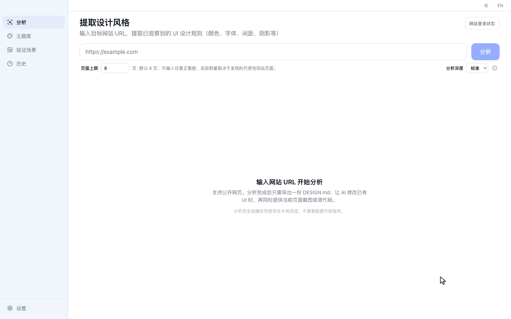
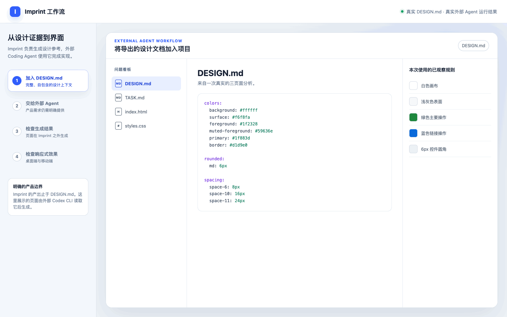

<div align="center">
  

  <h1>印记 · Imprint</h1>

  <p><strong>从目标网站提取视觉语言，生成可供 AI 复用的设计系统。</strong></p>

  <p>
    提取颜色、字体、间距、圆角、阴影和组件风格。
    Desktop 导出一份完整的 DESIGN.md。CLI 与 MCP 自动化入口目前可从源码构建，正式安装包将在后续阶段发布。
  </p>

  <p>
    <a href="./README.md">English</a>
    ·
    <a href="https://github.com/woai3c/imprint/releases/latest">下载安装</a>
    ·
    <a href="#功能">功能</a>
    ·
    <a href="#开发">开发</a>
  </p>
</div>

<p align="center">
  
</p>

<p align="center"><sub>真实分析 3 个公开页面；本次分析实际等待 74 秒，GIF 中已明确压缩等待时间。</sub></p>

## Imprint 是什么？

Imprint 是一个开源桌面应用，可以提取目标网站的视觉语言，并将其转换成可供 AI 辅助开发和前端项目复用的设计系统。

它会观察颜色、字体、间距、圆角、阴影、布局规律和组件风格，并生成可供 AI Coding Agent 和前端项目参考实施的结构化输出。

AI 是这些输出的下游使用者，不是提取过程的依赖。核心分析、声明和导出由确定性程序完成，不需要模型厂商、
API Key 或本地 Agent 运行时。

Imprint 仅接受网站 URL 作为分析输入，不支持分析独立的截图文件。截图只包含某个时刻渲染后的像素，无法可靠还原
DOM 层级、计算样式、响应式规则或交互状态。Imprint 展示并在证据输出中引用的截图，由分析器从已加载的网站中
自动捕获，作为 URL 分析的可追溯视觉证据。

不只依赖 AI 对视觉风格的猜测，而是为它提供建立在真实网页观察证据上的设计指导。

```text
网站 URL
       ↓
    Imprint
       ↓
可复用设计系统 / DESIGN.md
       ↓
Claude Code / Codex / 其他 AI Agent
       ↓
复用所提取视觉语言的产品界面
```

## 为什么需要 Imprint？

AI Coding 可以快速生成界面，但生成结果可能依赖模型已有认知和临时判断，也可能难以在多个页面之间保持一致。

单靠提示词很难持续传递一套设计语言。Imprint 将真实网站中观察到的证据转换成结构化指导，并明确记录其适用范围、
置信度、覆盖情况和局限。

## 产品目标与使用边界

Imprint 的目标是让网站的视觉语言能够被复用。它记录实际观察结果、保留可追溯性，并为外部 AI Agent 提供能够应用到其他
前端项目中的设计规则和精确值。

生成的设计指导只覆盖成功观察到的页面、视口和状态。`DESIGN.md` 会记录覆盖范围和局限，帮助下游 Agent 复用有证据支持的
规则，而不把未观察到的行为当成事实。目标产品的业务需求和最终实现仍由用户及其选择的 Agent 决定。

## 功能

| 功能           | 说明                                                                    |
| -------------- | ----------------------------------------------------------------------- |
| 网站分析       | 输入 URL，自动分析网页视觉风格                                          |
| 多样化页面发现 | 联合导航链接与 sitemap，选择有代表性的同站页面                          |
| 可追溯证据     | 记录页面拓扑、区块几何、组件实例、视口覆盖和证据限制                    |
| Token 置信度   | 保存每个 token 的来源、页面覆盖和确定性置信度                           |
| 截图证据       | 自动捕获已分析页面和视口，作为可追溯的视觉证据                          |
| 设计系统生成   | 提取已观察到的颜色、字体、间距、圆角、阴影和组件风格                    |
| AI 友好文档    | 导出 Google DESIGN.md alpha，并保留可追溯的 Imprint 扩展                |
| 代码导出       | 从源码构建的 CLI/MCP 支持 CSS Variables、Tailwind CSS v4 和 JSON Tokens |
| Agent 集成     | 当前通过 Desktop 导出物使用；可安装的本地 MCP 将在下一阶段发布          |
| 本地优先存储   | 所有数据保存在本地 SQLite，无需注册账号                                 |
| 网站主题库     | 保存分析快照，并在隔离的固定验证场景中预览其设计令牌                    |
| 内置主题       | 国风山水、赛博朋克、极简北欧、毛玻璃等多种设计风格                      |
| 验证场景       | 在工作流、内容展示与交互状态中检验主题的层级、密度和可读性              |

## 与 AI Coding Agent 配合使用

1. 使用 Imprint 分析网站 URL。
2. 导出生成的 `DESIGN.md`。
3. 将 `DESIGN.md` 放到目标项目中。
4. 给 AI Coding Agent 以下指令：

> 实现前先阅读 DESIGN.md。在文档声明的范围内采用“核心设计规则”；只有目标页面出现对应组件和变体时，才使用“场景化组件模式”；“局部设计观察”仅作为相符场景下的参考。保留当前产品需求，不要复制来源网站的品牌、文案和受版权保护的内容。

<p align="center">
  
</p>

<p align="center"><sub>这是一次使用导出 DESIGN.md 和固定产品任务的真实 Codex CLI 执行。Imprint 负责生成设计参考，不负责生成页面；该示例演示使用流程，不代表普遍质量保证。</sub></p>

### 应该导出哪一种？

Desktop 的 AI 工作流只导出一份完整的 `DESIGN.md`。从源码构建的 CLI 和 MCP 还提供下列专用格式，用于自动化和
直接实现；它们的正式安装包将在后续阶段发布。

| 目标                               | 推荐输出                 | 一起提供             |
| ---------------------------------- | ------------------------ | -------------------- |
| 让 AI 修改已有 UI                  | **DESIGN.md**            | 当前 UI 截图或源代码 |
| 直接在 CSS 项目中实现              | **CSS Variables**        | 现有样式入口文件     |
| 直接在 Tailwind v4 项目中实现      | **Tailwind `@theme`**    | 项目的主题样式文件   |
| 交给工具链或需要结构化数据的 Agent | **Tokens JSON**          | 具体的自动化任务说明 |
| 审计来源页面的实际观察范围         | **Design Evidence JSON** | 对应页面截图         |

如果只给 AI 一个导出文件，请选择 **DESIGN.md**。

Imprint 生成的 `DESIGN.md` 遵循 [Google Labs DESIGN.md alpha 规范](https://github.com/google-labs-code/design.md)：先构建类型化文档模型，再按规范 YAML 分组和固定章节顺序渲染。紧凑的 `x-imprint` 扩展只保留来源、覆盖率、分析摘要、响应式元数据和 alpha 规范暂未覆盖的令牌；完整令牌溯源保留在 Tokens JSON 与 `design-evidence.json` 中。

## 确定性设计上下文

每次分析都会生成确定性的 `DesignEvidence`：多视口截图、页面拓扑、归一化区块与组件几何、响应式差异、安全交互观察、
媒体层、覆盖范围和限制。程序规则再将证据转换为稳定、可追溯的 Design Profile、重构简报、验证方案和导出物。相同的
捕获证据会生成完全相同的上下文。

Imprint 不包含模型厂商、API Key 设置或 Agent CLI 执行路径。外部 Coding Agent 可以通过文件或 MCP 使用分析完成后的
产物，但不会参与提取，也不能改变来源事实。

## CLI 与 MCP

> **发布状态：** GitHub Releases 当前只发布 Desktop 应用。CLI 与本地 stdio MCP 已实现并经过测试，但目前仍是
> 源码构建预览。可安装的软件包和受支持的 MCP 客户端配置将在下一产品阶段发布，不包含在当前 Desktop 安装包中。

```bash
pnpm build:cli
imprint doctor
imprint doctor --browser-path "/path/to/chrome" --json
imprint extract https://example.com --viewport all --format evidence
imprint extract https://example.com --pages 5 --discovery auto --format json
imprint extract https://example.com --viewport all --format profile
```

CLI 与 MCP 不依赖 Imprint 托管服务、正在运行的 Desktop 应用、模型厂商或 API Key，二者都在用户电脑本地运行。
当前从源码构建时仍需要 Node.js 20.19 或更高版本，以及本机已安装的 Chrome、Edge 或兼容的 Chromium；分析公网
URL 时还需要能够正常访问目标网站。未来的软件包会安装所需的 JavaScript 依赖，但不会捆绑浏览器。

MCP 还需要支持 MCP 的 Coding Agent 或客户端。客户端会在本地启动 `imprint-mcp` 进程，并通过 stdin/stdout 与其
通信。这里的“服务器”只是本地工具进程，不需要远程部署，也不需要由 Imprint 运营服务器。

`imprint doctor` 会检查 Node.js、操作系统、浏览器可执行文件，并实际启动一次无页面导航的 headless 浏览器。
`--browser-path` 可以明确指定 Chrome、Edge 或 Chromium；无效的显式路径会直接失败，不会静默回退。CLI 使用稳定退出码：
`0` 表示成功，`2` 表示命令或参数错误，`3` 表示运行环境依赖缺失或不可用，`4` 表示捕获或导出失败，`130` 表示 SIGINT 取消。

MCP 服务器提供确定性的 `imprint_extract` 与 `imprint_compare` 工具，不需要任何厂商凭据。`imprint_compare` 可以接收
两个 URL 或两个已经导出的 Design Profile，并按 token 或确定性设计语言进行比较。

## 下载安装

从 [GitHub Releases](https://github.com/woai3c/imprint/releases/latest) 下载最新 Desktop 版本。CLI 与 MCP 的
正式安装包将在后续阶段发布。

| 平台    | 架构                  |
| ------- | --------------------- |
| Windows | x64                   |
| macOS   | Apple Silicon (arm64) |
| macOS   | Intel (x64)           |

## 技术栈

| 层级     | 技术                         |
| -------- | ---------------------------- |
| 桌面框架 | Electron + Electron Forge    |
| 前端     | React 19 + TypeScript + Vite |
| UI       | Tailwind CSS v4              |
| 状态管理 | Zustand                      |
| 数据存储 | SQLite (better-sqlite3)      |
| 网页分析 | Playwright                   |
| 国际化   | i18next + react-i18next      |

## 开发

```bash
# 安装依赖
pnpm install

# 启动开发模式
pnpm dev

# 打包应用
pnpm build

# 构建分发包（Windows 输出 zip，macOS 输出 DMG）
pnpm make

# 运行确定性 E2E 测试
pnpm test:e2e
```

## 发布

在干净的 `main` 分支执行：

```bash
pnpm release
```

发布命令会运行仓库检查、更新版本与 changelog、创建带注释的版本标签，并在确认后推送。标签会触发 GitHub Actions，
当前只构建 Windows x64、macOS arm64 和 macOS x64 的 Desktop 原生发行产物。CLI 与 MCP 的软件包发布流程将在
后续阶段加入。

## 项目结构

```
src/
├── main/                # Electron 主进程
│   ├── analyzer/        # 网页分析引擎（Electron 包装层）
│   ├── database.ts      # SQLite 数据库
│   ├── ipc.ts           # 桌面分析、持久化与导出处理
│   └── preload.ts       # 类型化 Renderer 桥接
│
├── core/                # 共享提取引擎（CLI + MCP + 桌面）
│   ├── analyzer/        # 样式提取、颜色聚类、Token 构建
│   ├── design-evidence/ # 稳定的观察证据与覆盖信息
│   ├── design-context/  # 已校验 Profile、简报、上下文与验证
│   └── export/          # CSS / Tailwind / JSON / Markdown / SCSS 生成器
│
├── cli/                 # CLI 入口（imprint 命令）
├── mcp/                 # MCP stdio 服务器（imprint-mcp 命令）
│
└── renderer/            # React 前端
    ├── components/
    ├── pages/
    ├── stores/
    └── i18n/
```

## 许可证

MIT
