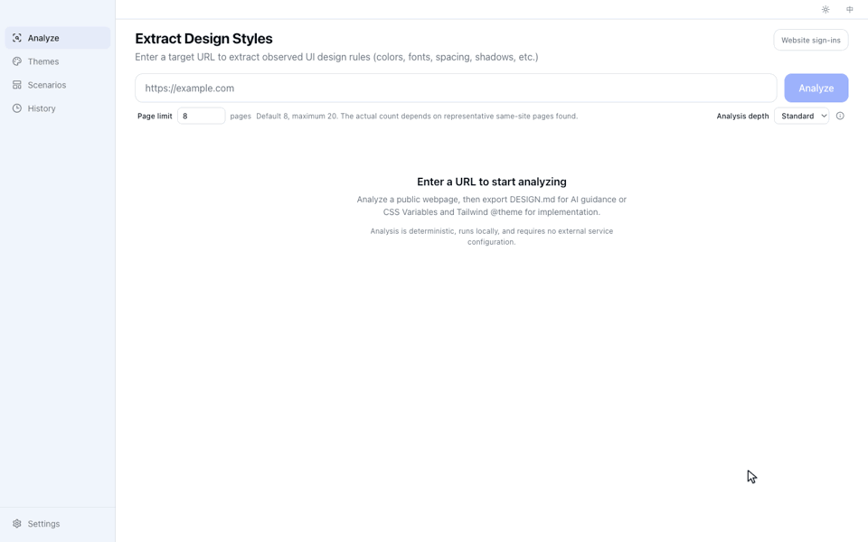
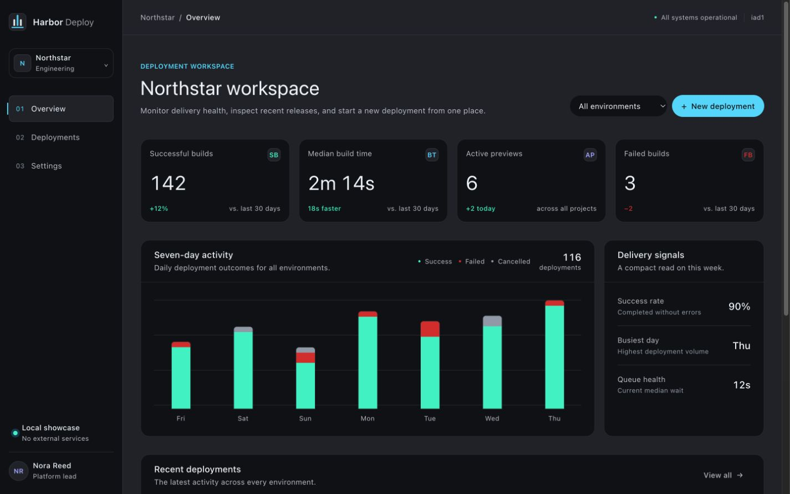
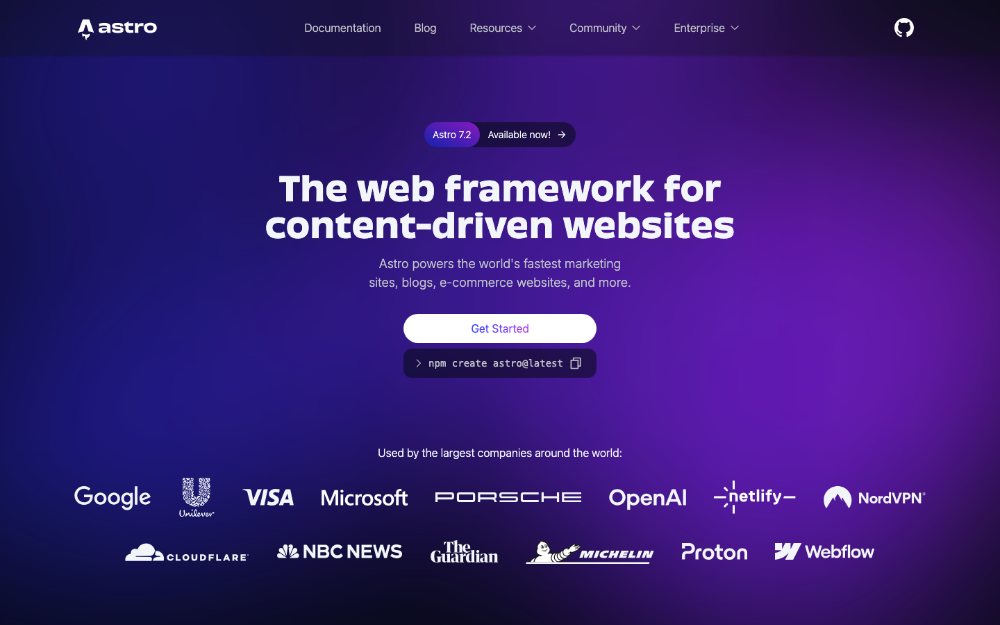
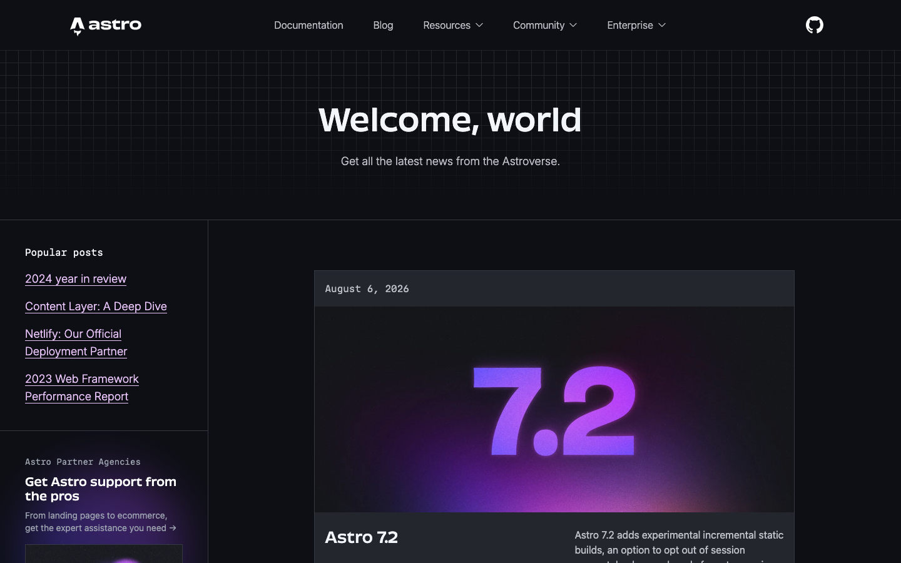
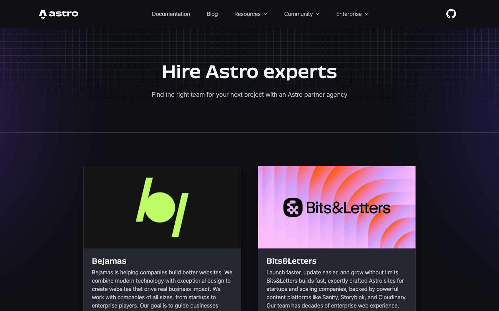
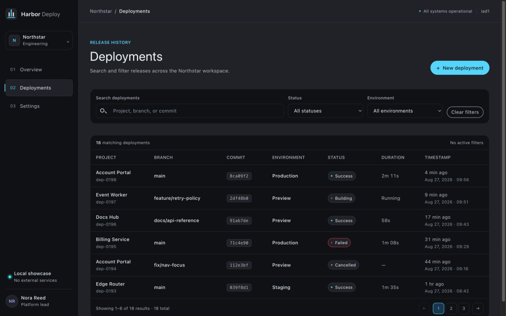
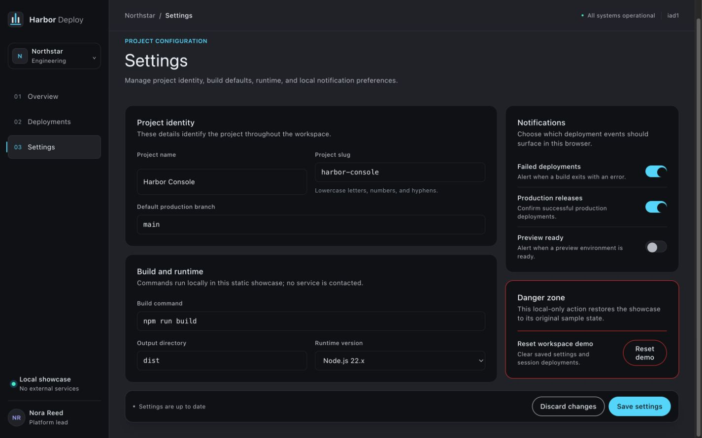

# Public case: Astro → Harbor Deploy

[简体中文](./README.zh-CN.md)

This reproducible case follows one complete workflow:

```text
Astro website URL → Imprint 0.1.0 → DESIGN.md + CSS variables → external Codex CLI → Harbor Deploy
```



[Watch the 42-second MP4](../../media/imprint-astro-case-en.mp4). The recording combines a real Desktop rerun with
the verified agent run and result documented below. The live Desktop rerun took 133 seconds; its waiting period is
visibly time-compressed. The frozen artifact set in this case comes from the separately recorded 36.8-second run in
the facts table, so the edited recording is a workflow demonstration rather than the provenance record.



The result is an original, neutral three-view deployment console. It does not copy Astro's name, logo, text,
illustrations, assets, or page composition.

## Why this source and target?

[Astro](https://astro.build/) is a useful public source because its home, blog, and agency pages expose a distinctive
dark visual language across different content structures. It is also familiar to the likely audience for Imprint. This
is a documented example, not a claim that Astro is a universal benchmark.

Harbor Deploy was chosen as the target because a dense developer console is structurally unlike a framework marketing
site. Its overview, deployment table, filters, settings, status states, and responsive layout test whether the observed
design language can transfer without copying the source product.

## Open the result without installing anything

1. Download [harbor-deploy-sample.zip](./harbor-deploy-sample.zip).
2. Unzip it and double-click `index.html`.
3. Open `#/overview`, `#/deployments`, and `#/settings` through the navigation.

The sample has no dependencies, remote assets, network requests, build step, account, or deployment.

## Recording structure

The included GIF and MP4 use one continuous three-step story:

1. Enter the website URL and run a real analysis. Compress only the waiting period and label that edit on screen.
2. Show `DESIGN.md` plus the fixed product task going to an external coding agent. Keep Imprint's and the agent's roles
   explicit.
3. Show the overview, deployments, and settings routes from the neutral result.

For future releases, keep the capture at 1440 × 900 and the final story between 30 and 45 seconds. Use the 960-pixel
GIF in the README and the H.264 MP4 for Release pages and social posts. Keep the URL, actual wait disclosure, and result
scope visible; never describe the captured source screenshots as analysis inputs.

## Source evidence

Imprint received only `https://astro.build/` as analysis input. The screenshots below were captured automatically from
the loaded website as traceable evidence. They were not analysis inputs and were not provided to the coding agent.

| Home                                                               | Blog                                                               | Agencies                                                                       |
| ------------------------------------------------------------------ | ------------------------------------------------------------------ | ------------------------------------------------------------------------------ |
| [](./evidence/home.png) | [](./evidence/blog.png) | [](./evidence/agencies.png) |
| [`astro.build`](https://astro.build/)                              | [`astro.build/blog`](https://astro.build/blog/)                    | [`astro.build/agencies`](https://astro.build/agencies/)                        |

## Inputs given to the coding agent

| File                                                 | Purpose                                                             |
| ---------------------------------------------------- | ------------------------------------------------------------------- |
| [Generated DESIGN.md](./artifacts/DESIGN.md)         | Evidence-backed visual rules, scope, coverage, and limitations      |
| [Generated CSS variables](./artifacts/variables.css) | Shared implementation values loaded globally by the result          |
| [Generated Tailwind v4 theme](./artifacts/theme.css) | Alternate implementation export preserved from the same analysis    |
| [Fixed product task](./prompt/TASK.md)               | Routes, content, states, and behavior required from Harbor Deploy   |
| [Agent constraints](./prompt/AGENTS.md)              | Local-only, neutral, no copying, no remote assets, immutable inputs |

The source screenshots were deliberately excluded from the agent inputs. This keeps the example focused on whether the
exported design guidance is useful rather than whether an agent can visually imitate a screenshot.

## Result

| Overview                                                                            | Deployments                                                                                  | Settings                                                                            |
| ----------------------------------------------------------------------------------- | -------------------------------------------------------------------------------------------- | ----------------------------------------------------------------------------------- |
| [](./result/screenshots/overview.png) | [](./result/screenshots/deployments.png) | [](./result/screenshots/settings.png) |

The complete dependency-free source is in [`result/`](./result/). The narrow layout was also checked at 390 × 844:
[mobile screenshot](./result/screenshots/overview-mobile.png).

## Recorded facts

| Item                            | Value                                               |
| ------------------------------- | --------------------------------------------------- |
| Imprint version                 | v0.1.0 (`78c1c0671611435a2e3b706a1065d755db74d3be`) |
| Analysis date                   | 2026-08-27                                          |
| Actual analyzed pages           | Home, Blog, Agencies                                |
| Analysis time                   | 36.8 seconds                                        |
| Page / capture / asset coverage | 3/3 pages, 6/6 captures, 6/6 valid assets           |
| Viewports observed              | Desktop, tablet, mobile                             |
| Interaction coverage            | 3 safely observed of 36 candidates; 33 skipped      |
| Coding agent                    | Codex CLI 0.149.0                                   |
| Agent result                    | 3 hash routes, generated in one controlled run      |

The automated case used the source-built CLI so the exact invocation and all formats could be recorded. The analyzer
and exports are shared with Desktop; the public v0.1.0 distribution remains Desktop only. See
[`manifest.json`](./manifest.json) for the command, environment, validation record, and SHA-256 hashes.

## Verification and boundaries

The result was rendered in Chrome at 1440 × 900 and 390 × 844. Direct routing, search, combined filters, pagination,
the new-deployment dialog, and settings dirty/discard behavior passed. The checked run produced no browser console
warnings or errors, and the mobile viewport had no horizontal overflow.

The source analysis reported horizontal overflow on observed source pages, skipped safe-interaction candidates, and a
responsive section-identity mismatch. These limitations remain in the generated `DESIGN.md`; they were not hidden to
make the example look cleaner. The live source can also change after the recorded analysis date.

This is one real run, not a universal quality guarantee. Imprint generated the design reference; the external coding
agent generated the page. Final product requirements and review remain the user's responsibility.

Astro names and source-page screenshots belong to their respective owners. This independent case is for analysis and
documentation and does not imply affiliation or endorsement.
