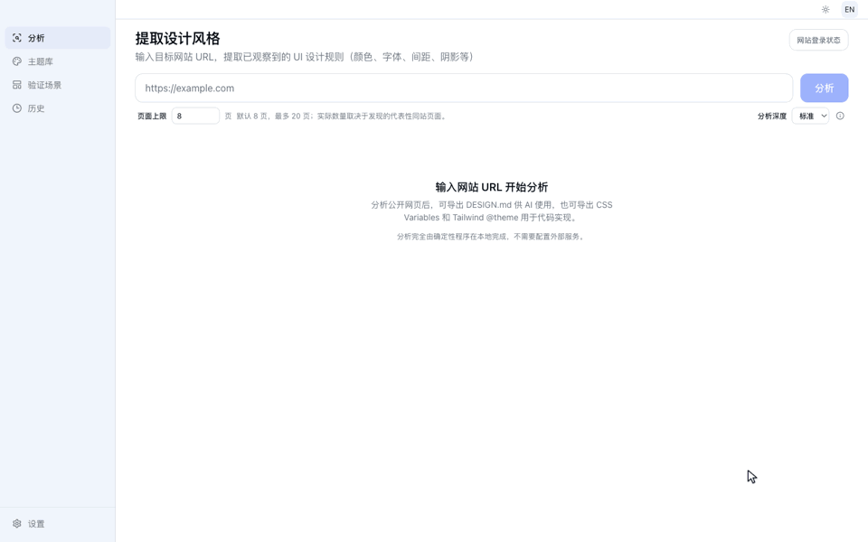

# 公开案例：Astro → Harbor Deploy

[English](./README.md)

这个可复现案例展示了一条完整流程：

```text
Astro 网站 URL → Imprint 0.1.0 → DESIGN.md + CSS Variables → 外部 Codex CLI → Harbor Deploy
```



[观看 40 秒 MP4](../../media/imprint-astro-case-zh-CN.mp4)。录屏把一次真实 Desktop 复跑与下方已验收的 Agent 执行和结果
剪辑在一起。录屏中的 Desktop 分析实际等待 44 秒，等待过程已明确压缩；本案例冻结的产物来自事实表中另一次 36.8 秒
的运行，因此成片用于演示工作流，不替代来源记录。


最终产物是一个原创、中性的三页面部署控制台，没有复制 Astro 的名称、Logo、文案、插画、素材或页面结构。

## 为什么选择这个来源和目标？

[Astro](https://astro.build/) 的首页、博客页和服务商页面在不同内容结构中呈现了辨识度较高的深色视觉语言，且 Imprint
的潜在用户通常对它比较熟悉，因此适合用作公开样例。它只是一个被完整记录的案例，不代表 Astro 是通用质量基准。

目标页面选择 Harbor Deploy，是因为高密度开发者控制台与框架宣传网站的结构明显不同。概览、部署表格、筛选、设置、
状态和响应式布局可以验证设计语言能否迁移到新产品，而不是验证 Agent 能否照抄来源页面。

## 无需安装即可查看

1. 下载 [harbor-deploy-sample.zip](./harbor-deploy-sample.zip)。
2. 解压后双击 `index.html`。
3. 通过导航打开 `#/overview`、`#/deployments` 和 `#/settings`。

这个样例没有依赖、远程素材、网络请求、构建步骤、账号或部署要求。

## 录制结构

已经生成的 GIF 和 MP4 使用一条连续的三步叙事：

1. 输入网站 URL 并执行真实分析，只压缩等待过程，而且在画面中明确标注。
2. 展示 `DESIGN.md` 与固定产品任务交给外部 Coding Agent，清楚区分 Imprint 和 Agent 各自负责什么。
3. 依次展示中性结果的概览、部署记录和设置页面。

后续版本建议继续用 1440 × 900 录制，把完整故事控制在 30～45 秒。README 使用宽 960 像素的 GIF，Release 页面和
社交平台使用 H.264 MP4。画面中保留 URL、真实等待说明和结果边界；不要把自动捕获的来源截图描述成分析输入。

## 来源证据

Imprint 的分析输入只有 `https://astro.build/` 这个 URL。下方截图是在网页加载后自动捕获的可追溯证据，既不是分析输入，
也没有提供给 Coding Agent。

| 首页                                                          | 博客                                                            | 服务商                                                                    |
| ------------------------------------------------------------- | --------------------------------------------------------------- | ------------------------------------------------------------------------- |
| [](./evidence/home.png) | [](./evidence/blog.png) | [](./evidence/agencies.png) |
| [`astro.build`](https://astro.build/)                         | [`astro.build/blog`](https://astro.build/blog/)                 | [`astro.build/agencies`](https://astro.build/agencies/)                   |

## 交给 Coding Agent 的输入

| 文件                                              | 用途                                                   |
| ------------------------------------------------- | ------------------------------------------------------ |
| [生成的 DESIGN.md](./artifacts/DESIGN.md)         | 有证据支持的视觉规则、适用范围、覆盖情况和局限         |
| [生成的 CSS Variables](./artifacts/variables.css) | 由结果页面全局加载的共享实现变量                       |
| [生成的 Tailwind v4 主题](./artifacts/theme.css)  | 同一次分析保留的另一种实现导出                         |
| [固定产品任务](./prompt/TASK.md)                  | Harbor Deploy 必须具备的路由、内容、状态和行为         |
| [Agent 约束](./prompt/AGENTS.md)                  | 仅本地、保持中性、不复制、无远程素材、输入文件不可修改 |

来源截图被刻意排除在 Agent 输入之外，目的是检验导出的设计指导是否有用，而不是检验 Agent 能否照着截图模仿。

## 生成结果

| 概览                                                                              | 部署记录                                                                                    | 设置                                                                              |
| --------------------------------------------------------------------------------- | ------------------------------------------------------------------------------------------- | --------------------------------------------------------------------------------- |
| [](./result/screenshots/overview.png) | [](./result/screenshots/deployments.png) | [](./result/screenshots/settings.png) |

完整的无依赖源码位于 [`result/`](./result/)。同时检查了 390 × 844 的窄屏布局：
[移动端截图](./result/screenshots/overview-mobile.png)。

## 本次运行事实

| 项目                   | 值                                                   |
| ---------------------- | ---------------------------------------------------- |
| Imprint 版本           | v0.1.0（`78c1c0671611435a2e3b706a1065d755db74d3be`） |
| 分析日期               | 2026-08-27                                           |
| 实际分析页面           | 首页、博客页、服务商页                               |
| 分析耗时               | 36.8 秒                                              |
| 页面 / 捕获 / 素材覆盖 | 3/3 页面、6/6 捕获、6/6 有效素材                     |
| 已观察视口             | 桌面、平板、移动端                                   |
| 交互覆盖               | 36 个候选中安全观察 3 个，跳过 33 个                 |
| Coding Agent           | Codex CLI 0.149.0                                    |
| Agent 结果             | 一次受控执行生成 3 条 hash 路由                      |

为了记录准确命令与全部导出格式，本案例通过源码构建的 CLI 自动执行。分析器和导出逻辑与 Desktop 共用；v0.1.0
面向公众发布的仍然只有 Desktop。命令、环境、验收记录和 SHA-256 哈希见 [`manifest.json`](./manifest.json)。

## 验收与边界

结果页面已在 Chrome 中以 1440 × 900 和 390 × 844 渲染检查。三条路由直达、搜索、组合筛选、分页、新建部署弹窗以及
设置的修改/放弃状态均通过；验收过程中浏览器控制台没有警告或错误，移动视口没有水平溢出。

来源分析报告了来源页面水平溢出、部分安全交互候选被跳过、响应式区块身份不匹配。这些局限仍保留在生成的
`DESIGN.md` 中，没有为了让案例更好看而隐藏。实时网站也可能在记录日期之后发生变化。

这是一次真实运行，不是普遍质量保证。Imprint 生成设计参考，外部 Coding Agent 生成页面；最终业务要求和结果审核
仍由用户负责。

Astro 名称和来源页面截图的权利归各自所有者。本案例仅用于独立分析和文档说明，不代表任何关联或背书。
